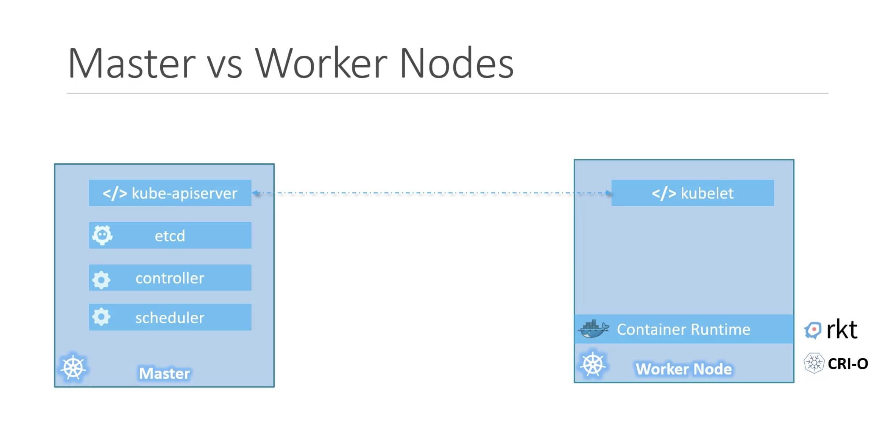
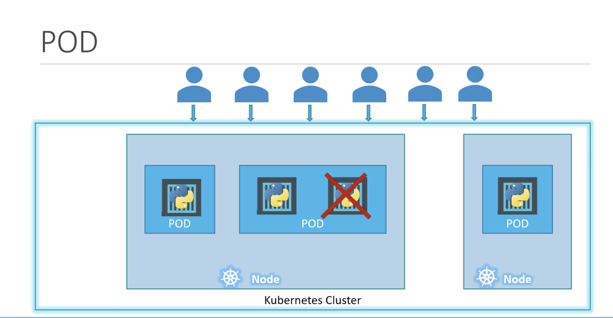
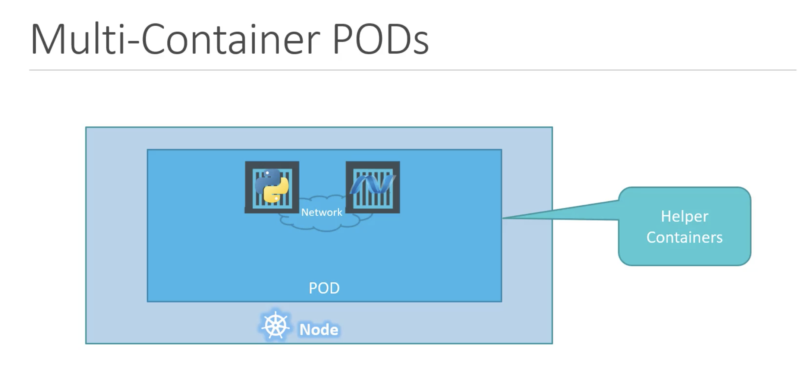

## Node

Node is a physical machine or virtual machine on which kubernetes is installed.  
A node is a worker machine(minions), where containers are launched by kubernetes.  
We need to have more than one node, inorder to maintain the application if one node fails.  

## Cluster
A cluster is a set of nodes grouped together. If one node fails, our application will be still accessible from other nodes.   
Having multiple nodes help in sharing load as well.  

## Master
A master is other node with kubernetes installed in it and is configured as a master.  
The master watches over the nodes in the cluster and is reponsible for the actual orchestration of containers on the worker nodes.  
Master node manages the cluster, this will have information about the members of the cluster, this monitor the nodes and when a node fails, this will move the load of the failed node to other worker nodes.  

## Components
When we install the kubernetes in the system, we are actually installing the following components.  
* `API Server` -- frontend for kubernetes. Users, management devices, CLI all talk to the apiServer to interact with kubernetes cluster.
* `etcd` -- key-value store (to store all data (in distributed manner) to manage cluster)
* `kubelet` -- agent that runs on each node on the cluster and make sure that containers are running as expected.
* `Container Runtime` -- used to run containers i.e., docker
* `Controller` -- brain behind otchestration, responsible for noticing and managing when nodes, containers, endpoints goes down.  
* `scheduler` -- distributes work to all containers across multiple nodes.  

## Master vs Worker Nodes

* Worker Node or Minion is where the containers are hosted. To run containers on the system, we need container runtime installed. Therefore, worker nodes will have container runtime (docker).
* Master node will have Kube-API server and thats make it a master.
* Worker node will have kubelet agent that is responsible to interact with the master to provide health information of the worker node and to carry out actions requested by the master on the worker nodes.
* All the information gathered is stored in the key-value store on the master. The key-value store is based on the popular etcd framework.
* The master also has Controller and Scheduler.

## Kubectl

Kubectl tool is used to deploy and manage application on kubernetes cluster like to get the cluster information, to get status of nodes and to manage many other things.

`kubectl run hello-minikube`  
kubetcl command is to deploy application on the cluster.  

`kubectl cluster-info`  
To view information about the cluster.  

`kubectl get nodes`   
To list all the nodes of the cluster.

## PODs

With Kubernetes, our ultimate aim is to deploy application in the form of containers on set of machines that are configured as worker nodes in a cluster.    
However, kubernetes does not deploy containers directly on the worker node. The container is encapsulated into kubernetes object known as POD.    
A POD is a single instance of an application. A POD is the smallest object that we can create in kubernetes.

PODs usually have a one to one relationship with containers running the application.   
To scale up, we create new POD. To scale down, we delete existing POD.  We do not add containers to existing POD to scale our application.  

### Multi-Container PODs

Though PODs have a one to one relationship with containers, we are not restricted to this.  
A single POD can have multiple container except that containers cannot be of same kind.   
In order to scale up our application, we need to create additional PODs. 

### Kubectl commands for PODs

To get the application image we need to specify the image name.
`kubectl run nginx --image=nginx`  
In this case nginx image is downloaded from the docker hub repository.
Here POD name can be anything, but image name should be the image that is available in the docker hub or any container registry.  

`kubectl get pods`   
To see the list of PODs in our cluster.

`kubectl describe pod nginx`  
To get more information related to the POD

`kubectl get pods -o wide`  
To get the status of the pod with additional information such as node where the pod is running and the IP address of the pod.

## PODs with YAML

