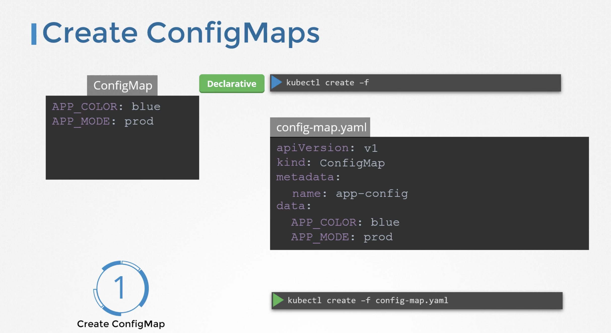

When we have a lot of pod definition files, it will be difficult to manage the environment data stored within the various files. We can take this information out of the POD definition file and manage it centrally using the Configuration maps.  
Config maps are used to pass configuration data in the form of key value pairs in kubernetes.  

When a POD is created, inject the config map into the pod. So the key value pairs are avilable as environment variables for application hosted inside the container in the POD.   
There are two phases involved in configuring configMaps.
* Create configMap.  
* Inject into POD. 

There are two ways of creating a configMap:  

configmap  
```
APP_COLOR: blue
APP_MODE: prod
```

1. Imperative way - `kubectl create configmap`   
without using configmap definition file.  

  

2. Declartaive way - `kubectl create -f <filename>`  
using configmap definition file.  



`kubectl get configmaps`  
To list all the available configmaps

`kubectl describe configmaps`  
This lists the configuration data.  

### ConfigMap in Pods

We have pod definition file and to inject an environment variable, add an new property to the container called envFrom. 
envForm property is a list and we can pass as many environment variables as required.  
Each item in the list corresponds to a configMap item. Specify the name of the configMap we created earlier.


