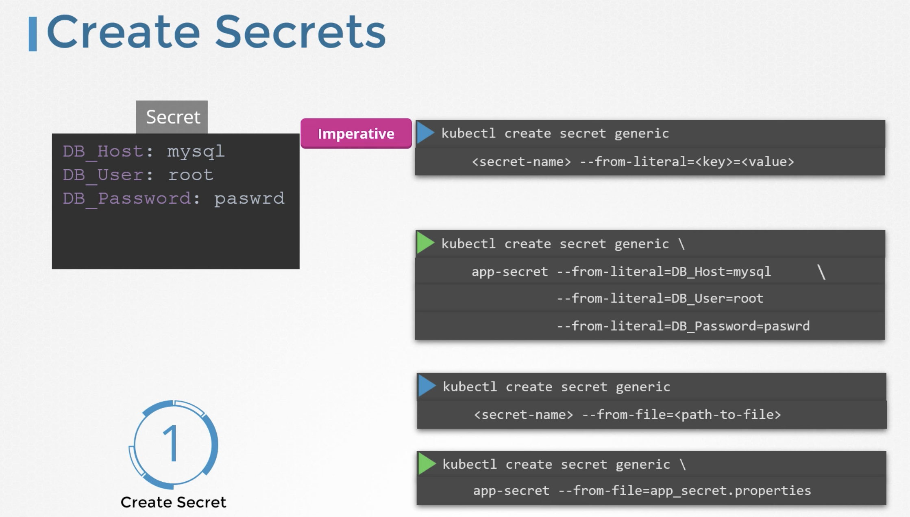

For example hardcoding host, username and passwords in th code is not a good idea.    
One option for this is to move these data to a configmap. configMap stores configuration data in plain text format. It will be ok to move the Hostname and username to the config but it is definetely not the right place to move the passwords.  

### Secrets

Secrets are used to store sensitive information.  
Secrets are similar to configMaps except that they are stored in an encoded or hashed format.  

There are two steps involved in working with secrets.  
1. Create a secret
2. Inject into a POD.

#### Create a secret

There are two ways to create secrets.  
* `Imperative way` - without using a secret definition file.  

* `Declarative way` - using a secret definition file.

We need to encode passwords and other important things while giving in definition file.  

`kubectl get secrets`  
To view the secrets available

`kubectl describe secrets`  
To view more information about the newly created secret. This shows the attributes of the newly created secret, but hides the values.

To view the values of secrets  
`kubectl get secret <secret name> -o yaml`  

If we want to decode the hash values
  

#### Inject into a POD

We inject secrets as environment variables in the pod definition file as below

