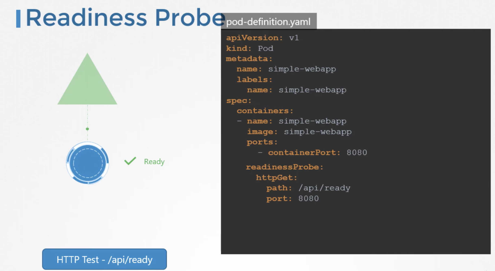
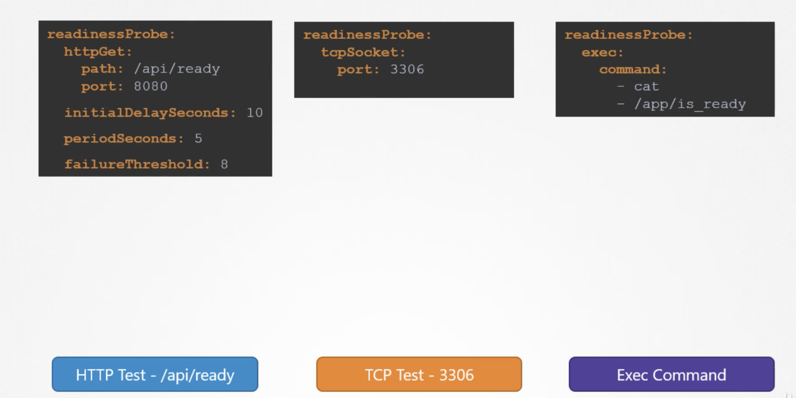
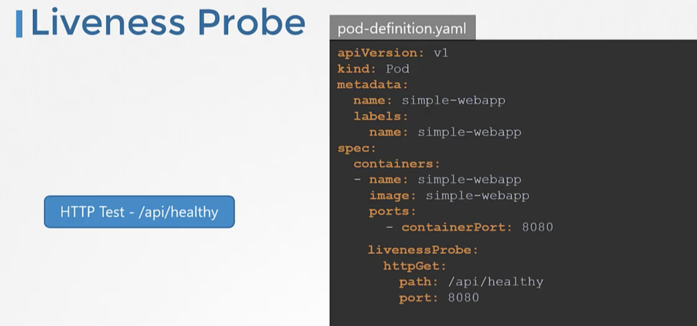
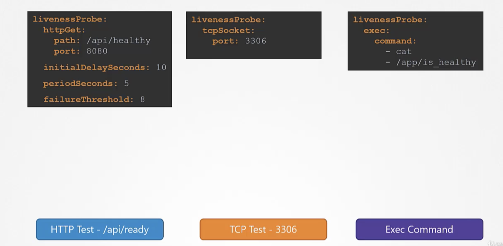

## Readiness Probes

### POD LifeCycle

A POD has a POD status and conditions.   

* A POD status tells us where a POD is in its lifecycle.  
  When a POD is creating, it will be in a `pending` state, this is when the scheduler tries to figure out, where to place the POD.  
  If the scheduler cannot find a node to place the POD, it remains in the `pending` state.  
  To find out, why it's stuck in a pending state run   
  `kubectl describe pod <podname>`  

  Once the POD is scheduled, it goes to `containerCreating` status, where are the images needed for the application are pulled and the container starts.   

  Once all the containers in a POD starts, it goes into a `running` state.  It continues to be in `running` state until the program gets completed successfully or it is terminated.  

  The status of the POD can be seen under `kubectl get pods`. The POD status only gives us the high level summary of the POD.  

* Conditions complement the POD status.   
  It is an array of True or False values, that tell us the state of a POD.  
  When a POD is scheduled on a node, the `POD scheduled` condition is set to `True` and when the POD is `initialised`, it's value is set to `True`.   
  When all the containers in the POD are ready, the `containersReady` is set to `True` and finally the POD itself is considered to be ready.  
  To see the status the POD conditions..  
  `kubectl describe <pod-name>`  -- under conditions.  
  We also see the ready state of the POD in the output of `kubectl get pods`.  

The `containersReady` or `Ready` condition indicates that the containers inside the pod are ready to accept the user traffic.

Normally servers takes some seconds to intialize the server and ready to serve the users. During this wait period, the pod continues to show that the container is ready to server. In this case, the status of the container is wrong.
By default, kubernetes assumes as soon as the container is created, it is ready to serve the user traffic.  
This makes users to hit a pod that is not yet running a live application.

We need a way to tie the ready condition to the actual state of the application inside the container.  

To check the application is ready or not, we can set up of different kinds of tests     
* In case of webservers - HTTP test - /api/ready
* In case of database - TCP test - particular TCP socket is listening or not
* customer script in the container that executes successfully when container is ready.

In the above cases, only when the test gets passed, the container will be set to ready state. These tests can be configures in pod-definition file as below

For a minimum of 10 seconds warmup we can add `initialDelaySeconds` option
To specify how often to probe, we can use  `periodSeconds` option
By default, if the application is not ready after 3 attemps the probe will stop.  
If we want to make more attempts use `failureThreshold` option.

  
## Liveness Probes

When we run an image of nginx using docker, it starts to serve the users. For some reason, the web server crashes and nginx process exists. The container exists as well.   
Since, docker is not an orchestration engine, the container continues to stays to dead and denies services to users, until we manually create other nginx container.  

In kubernetes orchestation, when we run the same application with kubernetes, everytime the application crashes, kubernetes makes an attempt to restart the container to restore service to users. (if we observe, number of restarts in `kubectl get pods` command get increases)  

If the application is not working (because of coding issues) but the container continues stay alive i.e., container is up but the users hitting the container are not served. In this case, container needs to be restarted or destroyed and a new container needs to be brought up. Here comes the liveliness probe. 

A liveliness probe can be configured on the container to periodically test whether the application within the container is actually healthy? If the test fails, the container is considered unhealthy and is destroyed and recreated.  
As a developer, we need to define what it means to a application to be healthy.  
* In case of a webapplication - when an api server is up and running.
* In case of a database - a particular TCP socket is listening.
* Simply execute a command to perform a test.

Liveness probe is configured in the pod definitionfile as readiness probe

