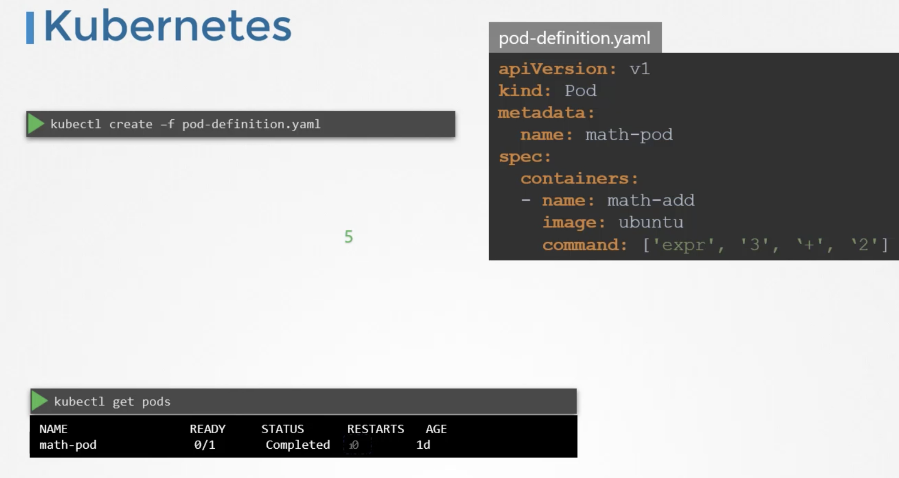
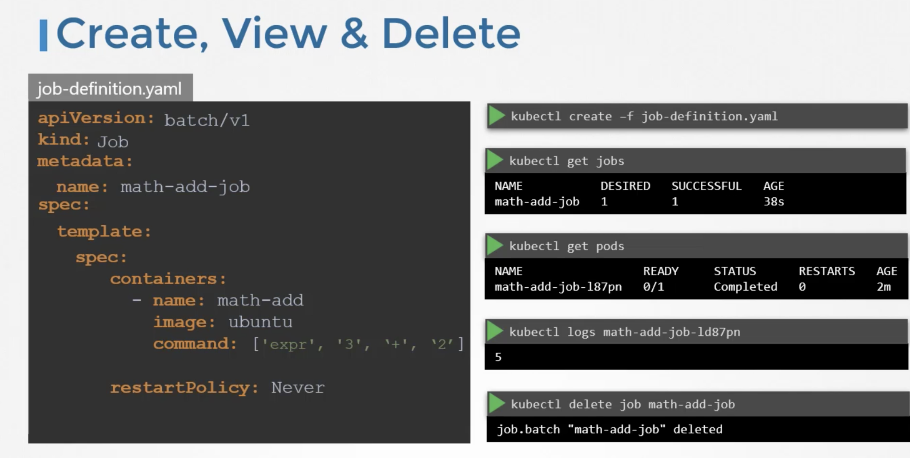
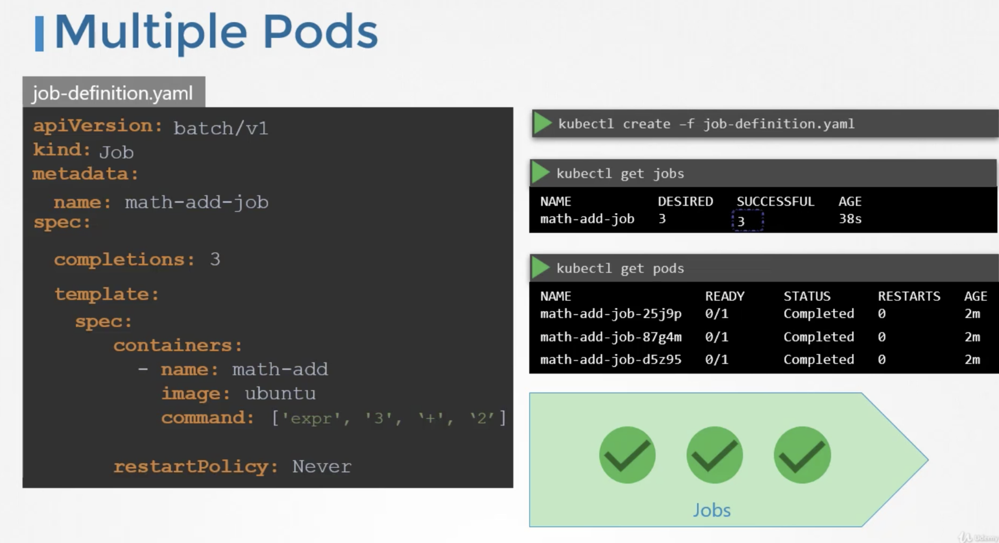
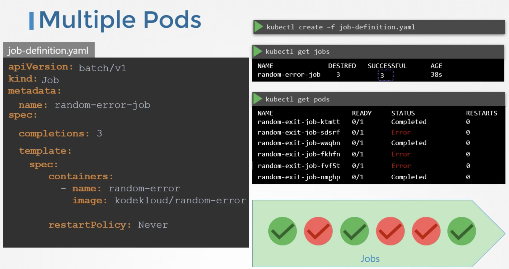

There are different types of workloads that a container can serve.  
Workloads such as web servers continue to run for a long period of time, until manually taken down.
There are other kinds of workloads such as batch processing, analytics or reporting, that are meant to carryout specific tasks and finish.  
Example: Performing a computation, processing an image, performing an analytic task, sending an email etc,. These are meant for short period of time.

Let us first see how these workloads work in docker.  
In Docker,  
`docker run ubuntu expr 3+2` (performs a simple math operation)  
In this case, docker container comes up, perform the simple operation, prints the output and then exists.  
when we run `docker ps -a` command, we see the container in exit state.  

In Kubernetes,  


Though the container computes output and exits, kubernetes continues to restart the container and bring it up again. This continues to happen until a threshold is reached. 

Kubernetes wants our applications to live forever. The default behaviour of pods is to attempt to restart the container to keep it running.  
This behaviour is defined by the property `restartPolicy` set on the pod which is by default set to always. Therefore, the pod always recreates the container when it exits. We can overwrite this behaviour by setting this property to `Never` or `Onfailure`. Thus, the kubernetes does not restart the container once the job is finished.

`pod-definition file`  
```yaml
apiVersion: v1
kind: Pod
metadata: 
  name: math-pod
spec:
  containers: 
    - name: math-add
      image: ubuntu
      command: ['expr', '3', '+', '2']

  restartPolicy: Never
```

While `replicaset` is used to make sure a specified number of pods are running at all time, a `job` is used to run a set of pods to perform a given task to completion.  

We create a job using a definition file. 

`job-definition file`
```yaml
apiVersion: batch/v1
kind: Job
metadata:
  name: math-add-job
spec:
  template:
  # pod-definition specification
    spec:
      containers:
        - name: math-add
          image: ubuntu
          command: ['expr', '2', '+', '3']
      restartPolicy: Never
```

To create a job
`kubectl create -f job-definition.yaml`   

To view the jobs  
`kubectl get jobs`  

The standard ouput of the container can be seen in container logs  
`kubectl logs <podname>`   

To delete the job  
`kubectl delete job <jobname>`  



### Job with multiple pods

To run multiple pods we set a value for `completions` under the job specification.



By default, the pods are created one after the other. The second pod is created only after the first is finished.  

If the pod fails, the job tries to create new pods until it has three successful completions, and that completes the job.


Instead of getting the pods created sequentially, we can get them created in parallel. For this add the property called `parallelism` to the job specification.
We set it to 3, to create 3 pods in parallel.



The job first creates 3 pods at once, two of which completes successfully. Now, we only need one more, it is intelligent enough to create one pod at a time, until we get a total 3 successful pods.

## CronJobs

A CronJob is a job that can be scheduled. We can schedule and run a CronJob Periodically. 
Example: A job to generate a report and send an email.  

`cronjob-definition file`
```yaml
apiVersion: batch/v1beta1
kind: CronJob
metadata: 
  name: reporting-cron-job
spec:
  # schedule option takes cron like format string, where it takes the time when the job is to be run
  schedule: "*/1 * * * *"
  jobTemplate:
    # Job spec
    spec: 
      completions: 3
      parallelism: 3
      template:
        spec:
          containers: 
            - name: reporting-tool
              image: reporting-tool
          restartPolicy: Never
```


To create cronjob  
`kubectl create -f <cronjob-definition-file>`  

To view the available cronjobs
`kubectl get cronjob`  


