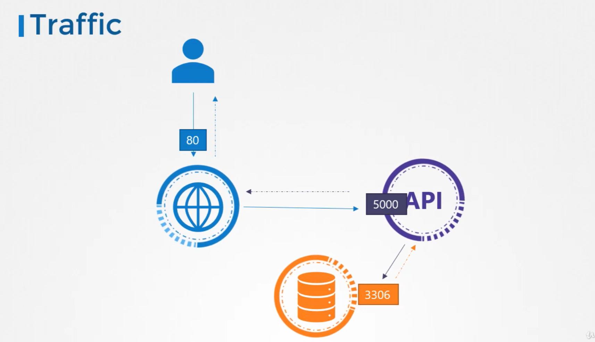
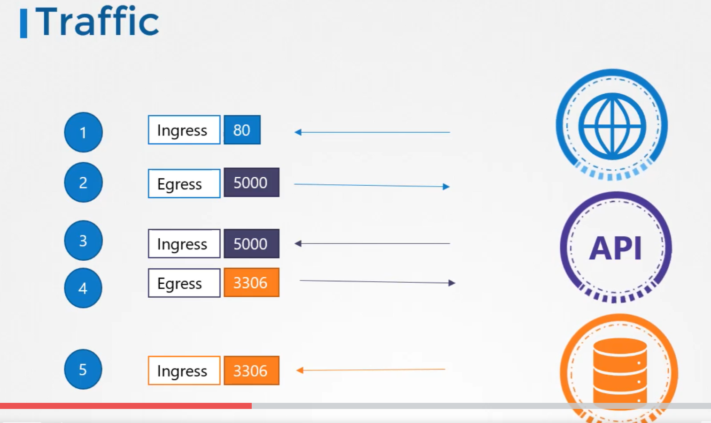
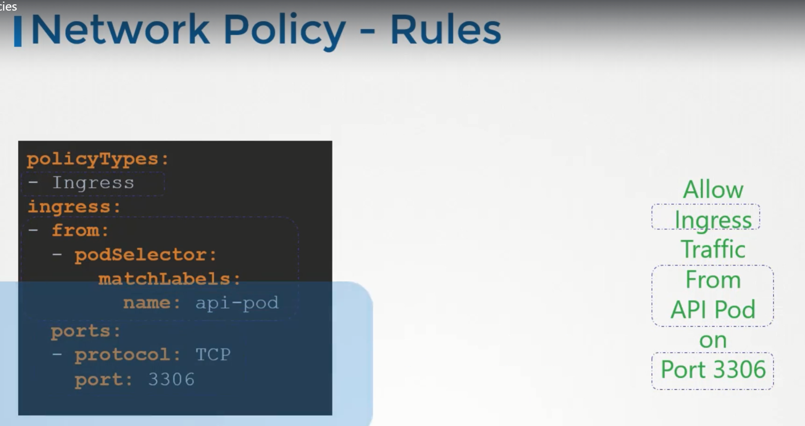
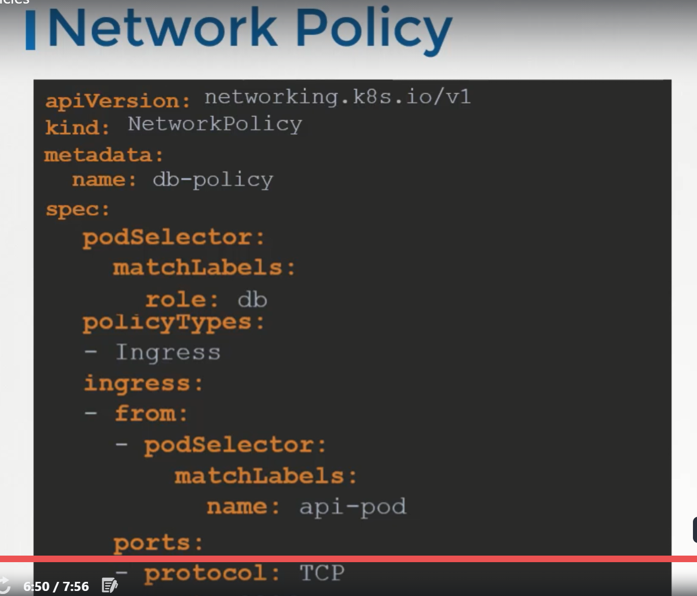

## Traffic  

For Example, we have a web server serving frontend to users, app server serving APIs and a database server.   
The user sends in a request to the weserver at port 80, the webserver then sends request to the API server at port 5000 in the backend. The API server then fetches data from database server at port 3306 and sends the data back to the user.  

We have two types of Traffic here.  
For a webserver, the incoming traffic from the users is an `ingress` traffic and the outgoing request to the appserver is `egress` traffic.  
While defining `ingress` and `egress`, we are just looking at the direction in which the traffic originated. The response to the user do not really matter.  
Similarly, in case of the backend API server. it receives ingress traffic at port 5000 and has egress traffic to the port 3306 to the database server.   
From the database server prespective, it receives ingress tarffic on port 3306 from the API server.  

To list the rules to get this working, we will have  
* Ingress rule that is required to accept HTTP traffic on port 80 on the webserver and   
* Egress rule to allow traffic from the webserver to the port 5000 on API server.
* Ingress rule to accept traffic on port 5000 on API server. 
* Egress rule to allow traffic to port 3306 on the database server.
* Finally, an Ingress rule on the database server to accept traffic on the port 3306.

## Network Security

One of the prerequiste for networking in kubernetes is whatever solution we implement, the PODs should be able to communicate with each other without having to configure any additional settings like routes.  

Kubernetes is configured by default with an `All Allow` rule that allows traffic from any POD to anyother POD or services within the cluster.  

In the before example, for each component in the application we deploy a POD. one for frontend server, one for API server and one for the database.  
We create services to enable communication between the PODS as well as to the enduser. 
Based on the `All Allow` policy, all PODs with communicate with each other in the kubernetes cluster.  

If we do not want frontend server to be able to communicate with the database server directly. For Example, security teams and audits require us to prevent that from happening.  

That is where, we would implement `Network Policy` to allow traffic to the DB server only from the API server.  

`Network Policy` is another object in the kubernetes namespace just like PODS, services. We link a `network policy` to one or more PODs. We can define rules within the network policy. In this case, we can say, only allow Ingress traffic from the API pod on port 3306.  
Once this policy is created, it blocks all other traffic to the pod and only allows the traffic that matches to specified rule.   
This is only applicable to the POD on which network policy is applied.  

To apply or link a network policy to a pod, we use labels and selectors.  We label the pod and use the same labels on the podSelector field in the network policy and then we build our rule.

Under policyType, we can specify to allow `Ingress` or `Egress` or both.  

To create a network policy  
`kubectl create -f <policy-definition file>`  

Note:   
Network policies are enforced by the network solution implemented on kubernetes cluster. Not all network solutions support network policy.  
A few of them that are supported are:  
* kube-router
* Romana
* Calico
* Weave-net

If we use Fannel as the networking solution, it does not support network policies.  

Even in a cluster configured with a solution that does not support network policies, we can still create the policies, but just that they will not enforced. We will not get the error message saying that network solution does not support network policies.

