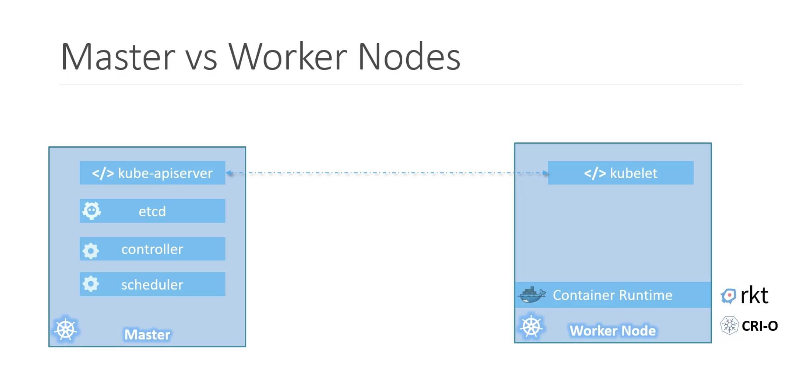
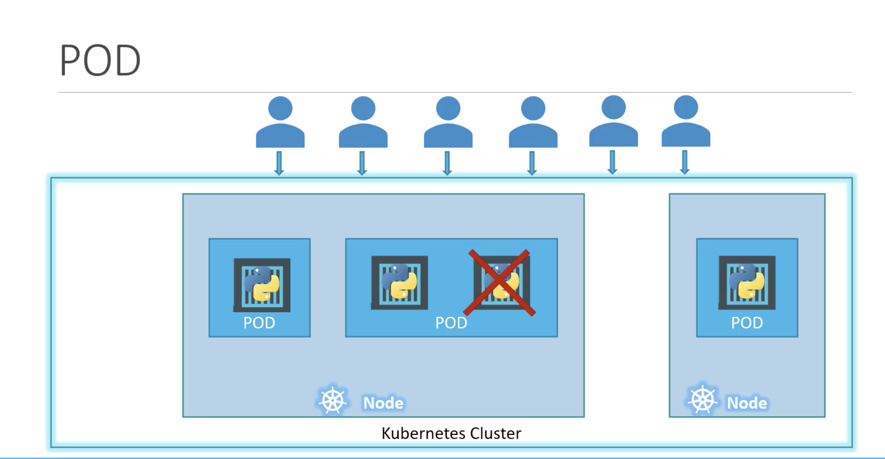
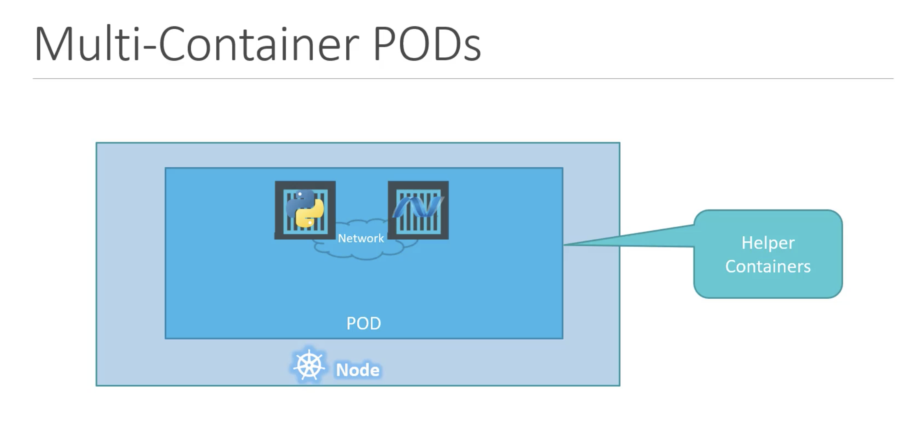
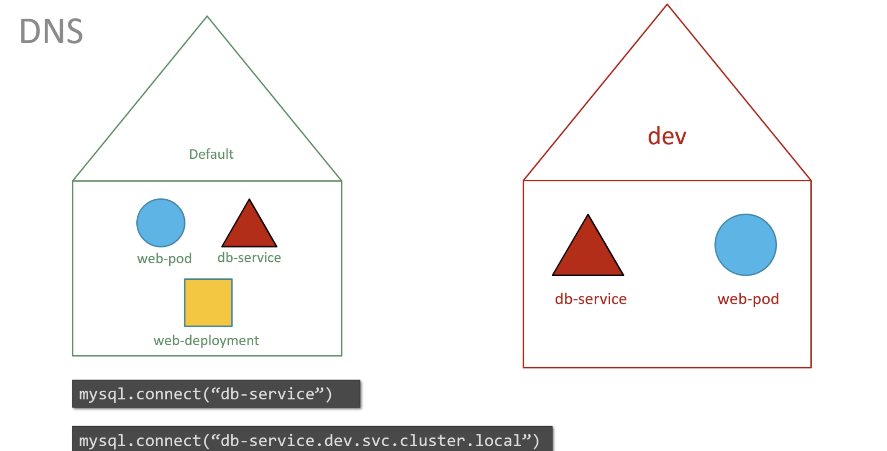
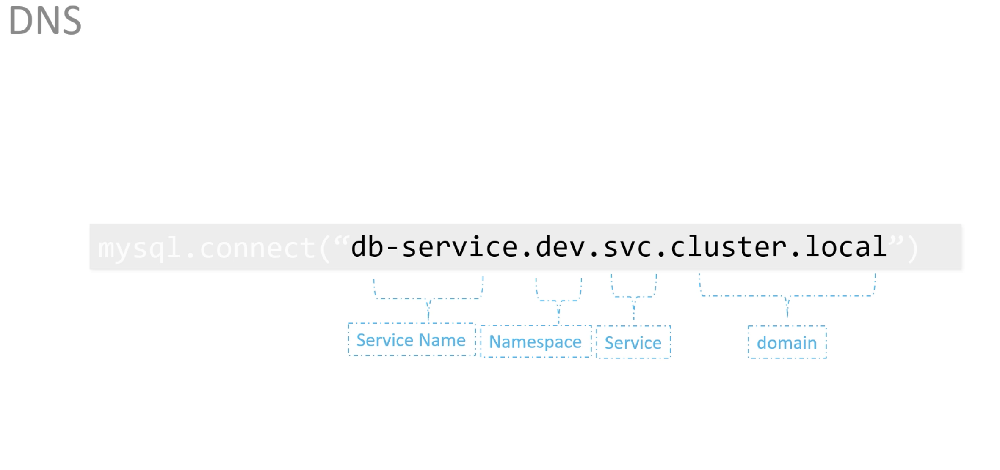

## Node

Node is a physical machine or virtual machine on which kubernetes is installed.  
A node is a worker machine(minions), where containers are launched by kubernetes.  
We need to have more than one node, inorder to maintain the application if one node fails.  

## Cluster
A cluster is a set of nodes grouped together. If one node fails, our application will be still accessible from other nodes.   
Having multiple nodes help in sharing load as well.  

## Master
A master is other node with kubernetes installed in it and is configured as a master.  
The master watches over the nodes in the cluster and is reponsible for the actual orchestration of containers on the worker nodes.  
Master node manages the cluster, this will have information about the members of the cluster, this monitor the nodes and when a node fails, this will move the load of the failed node to other worker nodes.  

## Components
When we install the kubernetes in the system, we are actually installing the following components.

* `API Server` -- frontend for kubernetes. Users, management devices, CLI all talk to the apiServer to interact with kubernetes cluster.  
* `etcd` -- key-value store (to store all data (in distributed manner) to manage cluster)   
* `kubelet` -- agent that runs on each node on the cluster and make sure that containers are running as expected.   
* `Container Runtime` -- used to run containers i.e., docker  
* `Controller` -- brain behind otchestration, responsible for noticing and managing when nodes, containers, endpoints goes down.   
* `scheduler` -- distributes work to all containers across multiple nodes.   


## Master vs Worker Nodes

* Worker Node or Minion is where the containers are hosted. To run containers on the system, we need container runtime installed. Therefore, worker nodes will have container runtime (docker).
* Master node will have Kube-API server and thats make it a master.
* Worker node will have kubelet agent that is responsible to interact with the master to provide health information of the worker node and to carry out actions requested by the master on the worker nodes.
* All the information gathered is stored in the key-value store on the master. The key-value store is based on the popular etcd framework.
* The master also has Controller and Scheduler.



## Kubectl

Kubectl tool is used to deploy and manage application on kubernetes cluster like to get the cluster information, to get status of nodes and to manage many other things.

`kubectl run hello-minikube`  
kubetcl command is to deploy application on the cluster.  

`kubectl cluster-info`  
To view information about the cluster.  

`kubectl get nodes`   
To list all the nodes of the cluster.

## PODs

With Kubernetes, our ultimate aim is to deploy application in the form of containers on set of machines that are configured as worker nodes in a cluster.    
However, kubernetes does not deploy containers directly on the worker node. The container is encapsulated into kubernetes object known as POD.    
A POD is a single instance of an application. A POD is the smallest object that we can create in kubernetes.



PODs usually have a one to one relationship with containers running the application.   
To scale up, we create new POD. To scale down, we delete existing POD.  We do not add containers to existing POD to scale our application.  

### Multi-Container PODs

Though PODs have a one to one relationship with containers, we are not restricted to this.  
A single POD can have multiple container except that containers cannot be of same kind.   
In order to scale up our application, we need to create additional PODs. 



### Kubectl commands for PODs

To get the application image we need to specify the image name.
`kubectl run nginx --image=nginx`  
In this case nginx image is downloaded from the docker hub repository.
Here POD name can be anything, but image name should be the image that is available in the docker hub or any container registry.  

`kubectl get pods`   
To see the list of PODs in our cluster.

`kubectl describe pod nginx`  
To get more information related to the POD

`kubectl get pods -o wide`  
To get the status of the pod with additional information such as node where the pod is running and the IP address of the pod.

## PODs with YAML

`pod-definition.yml`

```yaml
apiVersion: v1
kind: Pod
metadata: 
  name: myapp-pod
  labels: 
    app: myapp
    type: front-end
    # to differentiate the pods later if needed
spec:
  containers: 
  # container is a list/array.
  # PODs can have multiple containers within them.
    - name: nginx-container
      image: nginx
```

`kubectl create -f pod.definition.yml`  
With this command, kubernetes create the pod.

`kubectl delete pod <pod name>`   
To delete a particular pod.

If you are not given a pod definition file, you may extract the definition to a file using the below command

`kubectl get pod <pod-name> -o yaml > pod-definition.yaml`   

Use the `kubectl edit pod <pod-name>` command to edit pod properties.  

## Replication Controller

`rc-definition.yml`
```yaml
apiVersion: v1
kind: ReplicationController
metadata:
  name: myapp-rc
  labels:
    app: myapp
    type: front-end
spec:
    # template section to provide a pod template to be used by the replication controller to create replicas.
  template:
    metadata:
      name: myapp-prod
      labels: 
        app: myapp
        type: front-end
    spec:
      containers:
        - name: nginx-container
          image: nginx

  replicas: 3
```

## Replica set

replicaset-definition.yml
```yaml
apiVersion: apps/v1
kind: ReplicaSet
metadata:
  name: myapp-replicaset
  labels:
    app: myapp
    type: front-end
spec:
  template:
    metadata:
      name: myapp-prod
      labels: 
        app: myapp
        type: front-end
    spec:
      containers:
        - name: nginx-container
          image: nginx

  replicas: 3
  # selector section helps replicaset identify what pods fall under it.
  # We need to mention this (though we have provided pod template) because, replicaset can also manage pods which are not created as part of the replicaset creation.
  selector: 
    matchLabels:
      type: front-end
```
Selector is not required in the case of replication controller(still available, if not provided it assumes it to be the labels provided in the pod definition file), whereas a user input is required of this property in the case of replica set.  

This is because replica set can also manage PODs that are not created as psrt of the replica set creation.  

`kubectl create -f <filename>`    
To create a replica set 

`kubectl get replicaset`  
To view the created replicasets

### Scale
We started with 3 replicas and in future we decide to scale to 6. There are multiple ways to do this
1. update the number of replicas in the definition file to 6.
  `kubectl replace -f replicaset-definition.yml`  
  This will update the replicaset to have 6 replicas
2. `kubectl scale --replicas=6 -f replicaset-definition.yml` or
   `kubectl scale --replicas=6 replicaset myapp-replicaset` (type, name format, this won't change the number of replicas in the file).

## Deployments

To create a deployment we first create a deployment definition yaml file.
The contents of deployment definition file will be similar to the replicaset definition file, except the kind, which will be deployment.  

`kubectl create -f <deployment definition file>`  
To create the deployment.  

`kubectl get deployments`  
To view the created deployments. 
The deployment automatically creates replicaset. 

`kubectl describe deployment <deploymnet name>`  
To get more information about the particular deployment.

`kubectl get all`  
To view all the objects created in the kuberntes cluster.

### Rollout and Versioning

`kubectl rollout history <deployment name>`   
To view the revisions and history of deployment.  

## Namespaces

Whatever we create(pods, deployments) in kubernetes cluster, we will be doing inside a namespace. This namespace is called `default` namespace and it is automatically created by kubernetes when the cluster is first set up.  
Kubernetes creates a set of pods and services for internal purpose such as those required by networking solutions, DNS service etc,. To isolate these from the user and to prevent the users by accidentally delete or modify these objects, kubernetes creates them at another namespace created at startup named `kube-system`.   
Kubernetes also creates one more namespace automaticcaly and that is called `kube-public`, where resources available to all users are created.  

We can create our own namespaces as well.  
Each of the namespaces can have their own set of policies to define what to do.  
We can also assign quota of resources to each of the namespaces. In this way, each namespace is guaranteed a certain amount and does not use more than its allowed limit.  





### kubectl commands

`kubectl get pods`   
This command lists the pods in the default namespace.  

`kubectl get pods --namespace=kube-system`   
This command lists the pods of the kube-system namespace.  

`kubectl create -f pod-definition.yaml`  
This command creates the pod in the default namespace.  

To create the pod in other namespace, use the namespace option.  
`kubectl create -f pod-definition.yaml --namespace=dev`  
If we want this pod to be created always in the dev namespace, We can specify the namespace option in yaml file under metadata(`namespace: dev`) instead of giving it in the command file.

#### To create a namespace

`namespace-dev.yaml`

```yaml
apiVersion: v1
kind: Namespace
metadata:
    name: dev
```

`kubectl create -f namespace-dev.yaml`   
This command creates a namespace using yaml file.

We can simply create the namespace as below command  
`kubectl create namespace dev`   

To switch to dev(another namespace) permanently, so that we dont have to specify the namespace option anymore.
`kubectl config set-context $(kubectl config current-context) --namespace=dev`  

`kubectl get pods`
Now, this command lists the pods of dev namespace.  

`kubectl get pods --namespace=default`   
To list the pods from the default namespace.

To view pods in all namespaces.  
`kubectl get pods --all-namespaces`  
This will list all the pods in all the namespaces.  

### Resource Quota

To limit resources in a namespace, create a resource quota. 

`compute-quota.yaml`

```yaml
apiVersion: v1
kind: ResourceQuota
metadata:
  name: compute-quota
  namespace: dev
spec:
  hard:
    pods: "10"
    requests.cpu: "4"
    requests.memory: 5Gi
    limits.cpu: "10"
    limits.memory: "10Gi
```

To create a resource quota   
`kubectl create -f compute-quota.yaml`   


