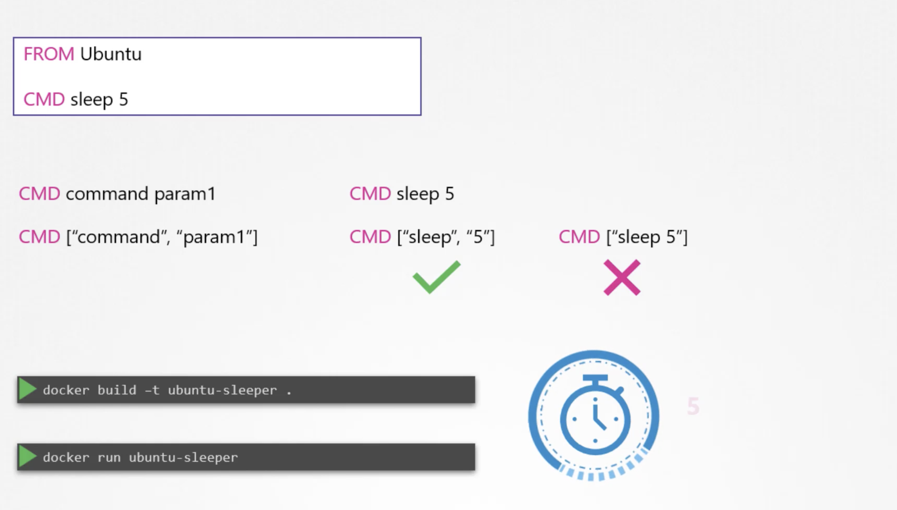
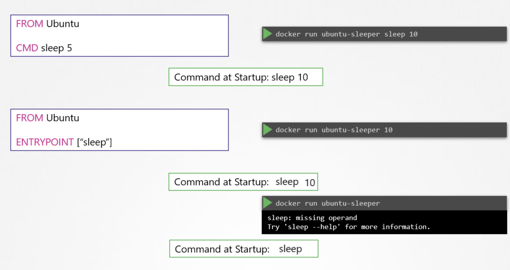
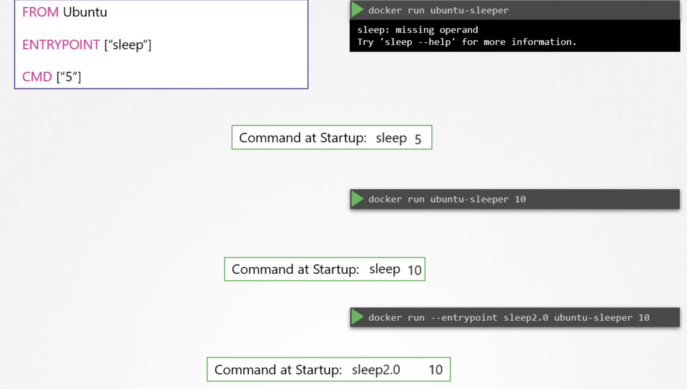
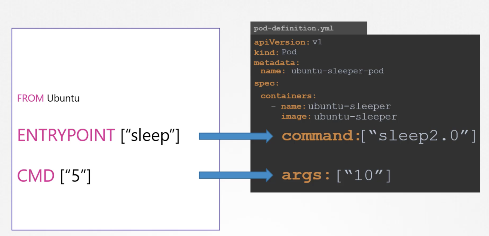

## Commands in Docker

`docker run ubuntu`  
This run an instance of image and exists immediately.  

`docker ps`  
we cannot view the ubuntu container as it existed.

`docker ps -a`
Here we can view the ubuntu container with status existed.  

Unlike VMs, containers are not meant to host an operating system, containers are meant to run a specific task or processes, such as to host an application server. Once the task is complete, the container exists. The container only lives as long as the process inside it is alive. If the webservice inside the container is stopped or crashes, the container exists.  

CMD in the docker file defines the program that will be run within the container when it starts.  

`docker run ubuntu [CMD]`  
The command specified here overwrites the CMD of ubuntu file.  
`docker run ubuntu sleep 5`  
with this, when container starts it runs the sleep program waits for 5 seconds and then exists.  
If we want the container to sleep for 5 seconds whenever it starts, we can change it in the docker file as below

To change the number of seconds it sleeps 

In case of `CMD` instruction, the command line parameters passed will get replaced entirely, whereas in case of `ENTRYPOINT`, the command line parameters we will get appended.  

  

## Commands and Arguments in Kubernetes

Anything that is appended to the docker run command will go into the args property of POD definition file in the form of an array.    
The args property in the definition file, will override the `CMD` instruction in the docker file.  
To override the `ENTRYPOINT`, in the docker world we would run the docker run command with entrypoint option set to the new command. The corresponding entry in the pod-definition file would be using a command field. The command field corresponds to `ENTRYPOINT` instruction in the docker file.  

