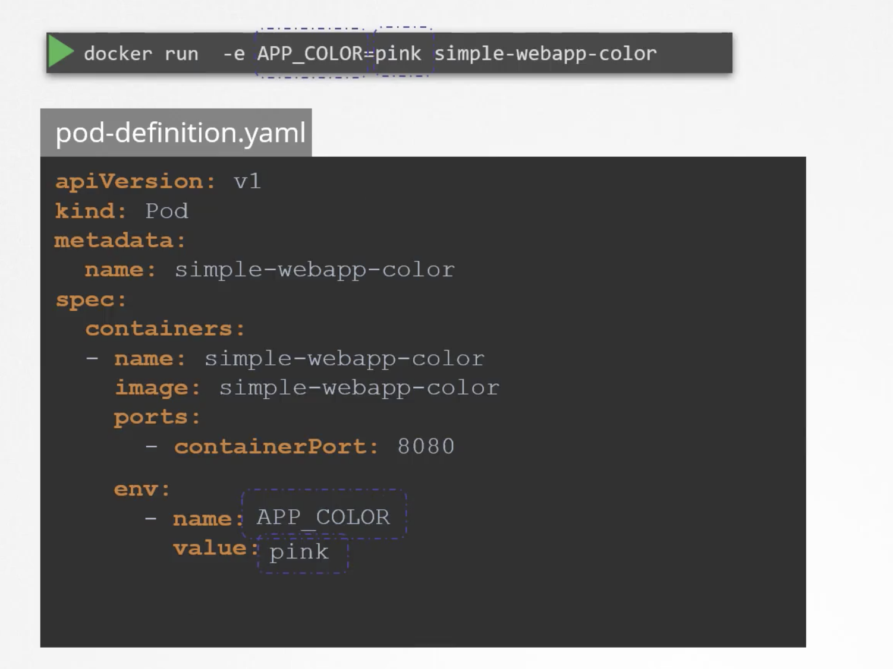
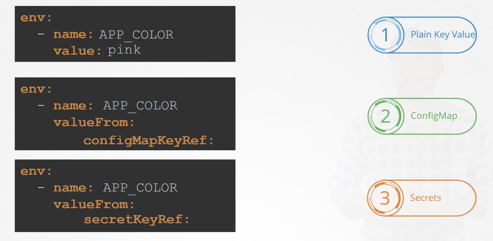

## Configuring env variables for pods.  

 

We have other ways to configure environment variables in the definition files i.e., using `configMapKeyRef` and `secretKeyRef`.   
We will know more about this in secrets.  

