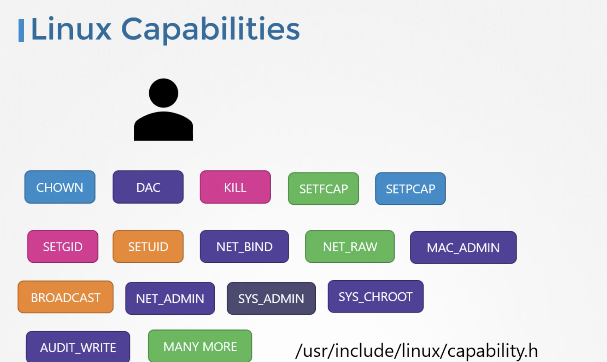

## Docker Security

Let's assume a host with docker installed on it. This host has a set of its own processes running such as a number of operating system processes, docker demeon, shh server etc,. We will now run an ubuntu docker container that runs and process that sleeps for an hour `docker run ubuntu sleep 3600`.  
We have learnt that unlike virtual machines containers are not completely isolated from their host. Container and host share the same kernel. Containers are isolated using namespaces in Linux. The host has a namespace and the containers have their own namespace. All the processes run by the containers are infact run on the host itself but in their own namespace. As far as the docker container is concerned, it is in its own namespace and it can see its own processes only. It cannot see anything outside of it.  
When we list the processes from within the docker container, we can see only sleep process with `process Id 1`.  
For the docker host, all processes of its own as well as those in the child namespaces are visible as just an another process in the system. So when we list the processes on the host, we see a list of processes including the sleep command but the different `process Id`. This is because the processes can have different process Ids in different namespaces and thus how docker isolates containers within a system.  
This is called `Process Isolation`.  

## Security - Users

The docker host has a set of users, a root user as well as number of non-root users. By default, docker runs processes within containers as the root user.   
Both within the container and ouside the container on the host, the process is run as the root user.  
If we do not want the process within the container to run as rhe root user, we may set the user using `user` option within the docker runcommand and specify the new userId.   
`docker run --user=1000 ubuntu sleep 3600`   
We will see that the process now runs with the new userId and another way to enforce user security is to have this defined in the docker image itself at the time of creation.

For Example: 

`Dockerfile` 
```
FROM ubuntu

USER 1000
```  
`docker build -t my-ubuntu-image .`  
`docker run my-ubuntu-image sleep 3600`  
This process will be run with the userId 1000.   

Docker implements set of security features that limits the abilities of root user within the container. The root user within the container isn't really like the root user on the host.   
Docker uses Linux capabilities to implement this. The root user is the most powerful user on the system, the root user can literally do anything and so does the process run by the root user. It has unrestricted access to the system such as modifying files and permission on files and so on....  



We can control and limit what capabilities are made available to the user. By default, docker runs a container with a limited set of capabilities so that the processes running within the container do not have privileges such as reboot the host or perform the operations that can disrupt the host or other containers running on the same host.   
If we want to override this behaviour and provide the additional privileges than what is avilable, use `cap-add` option in the docker run command.   
`docker run --cap-add MAC_ADMIN ubuntu`   
We can drop privileges as well using `cap-drop` option.   
`docker run --cap-drop KILL ubuntu`   
If we want to run the container with all the privileges available, use the `privileaged` flag  
`docker run --privileged ubuntu`   


