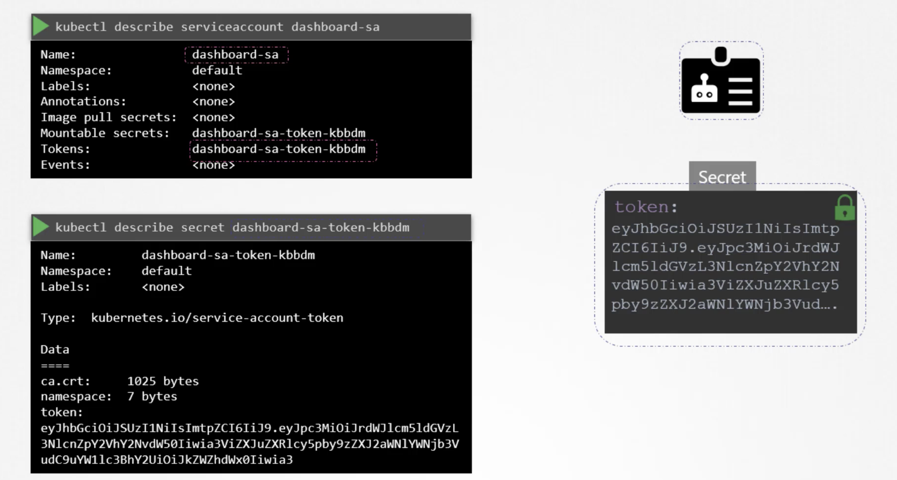
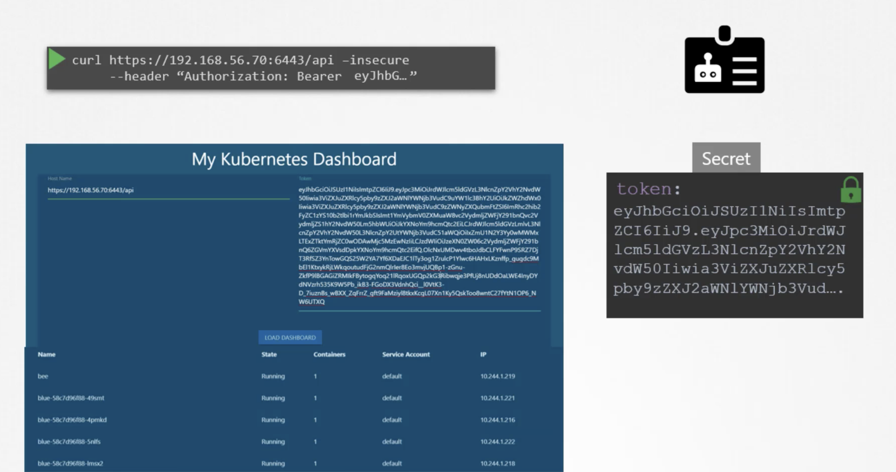
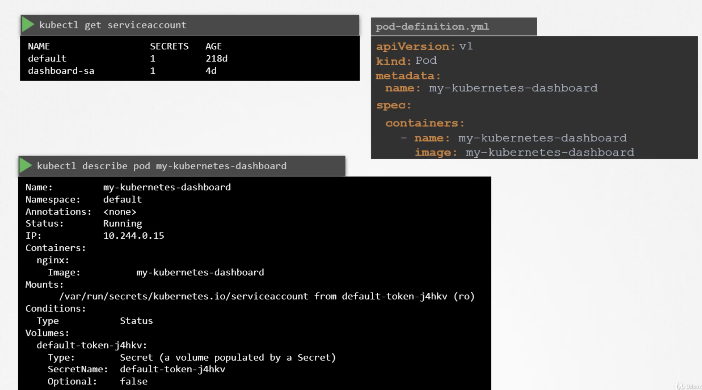
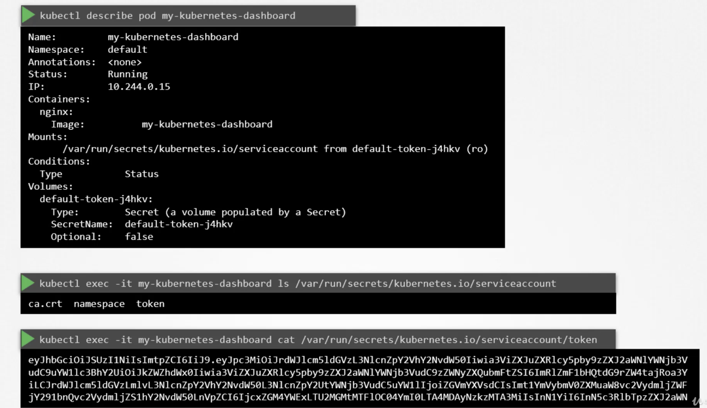
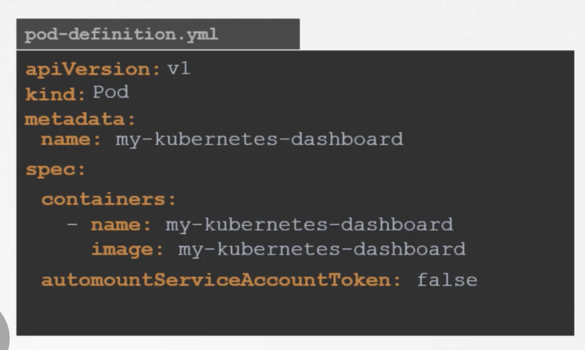

The concept of service accounts is linked to other security related concepts in kubernetes such as authentication, authorization, roll base access controls etc,.   

There are two types of accounts in the kubernetes.  

* `User Account`   
  The user account is used by humans.  
  A user account could be for an administor accessing the cluster to perform adminstrative tasks or a developer accessing the clusetr to deploy applications etc,.

* `Service Account`  
  The service account is used by machines.  
  A service account could be an account used by a an application to interact with the kubernetes cluster.  
  For example: An automated build tool like jenkins uses service accounts to deploy applications on the kubernetes cluster.  

To create a service account   
`kubectl create serviceaccount <account name>`   

To view all the service accounts
`kubectl get serviceaccount`  

To describe the service account   
`kubectl describe serviceaccount <account name>`     
When a service account is created, it also creates a token automatically.  

The service account token is what must be used by the external application while autrhenticating to the kubernetes-api. The token however is stored as the secret object. The secret object is linked to the service account.

  

This token can then be used as an authentication bearer token while making REST call to the kubernetes API.  

For Example: Using curl, We can use bearer token as authorization header while making REST call to the kubernetes API.

  

Thus, we can create a service account, assign the right permissions using roll based access mechanism(which we can see later), and export service account tokens and use it to configure third party application to authenticate to the kubernetes API.  

If the third party application is hosted on kubernetes cluster itself, the whole process of exporting service account token and configuring the third party application to use it can be made simple by automatically mounting service token secret as a volume inside the pod hosting the third party application. That way, the token to access the kubernetes API is already placed inside the POD and can be easily read by the application.  

For every namespace in kubernetes, a service account named default is automatically created. Each namespace has its own default servcie account.  
Whenever a POD is created, the default service account and its token are automatically mounted to that POD as a volume mount.

  

 

The default service account is very much restricted, it only has permissions to run basic kubernetes queries.   
If we want to use different service account(which we created), modify the pod-definition file to include a service account field and specify the name of the service account.  

"We cannot edit service account of the existimg POD, we must delete and recreate the POD. However, in case of deployment we can edit the service account of the POD, as any changes th POD file automatically trigger the new rollout for the deployment. The deployment will take care of deleting and recreating PODs with the right service account."  

Kubernetes automatically mounts default service account, if we haven't explicitly specify any.  We may choose not to mount a service account automatically by setting `automountServiceAccountToken` as `false` under `spec` section as below.

  

