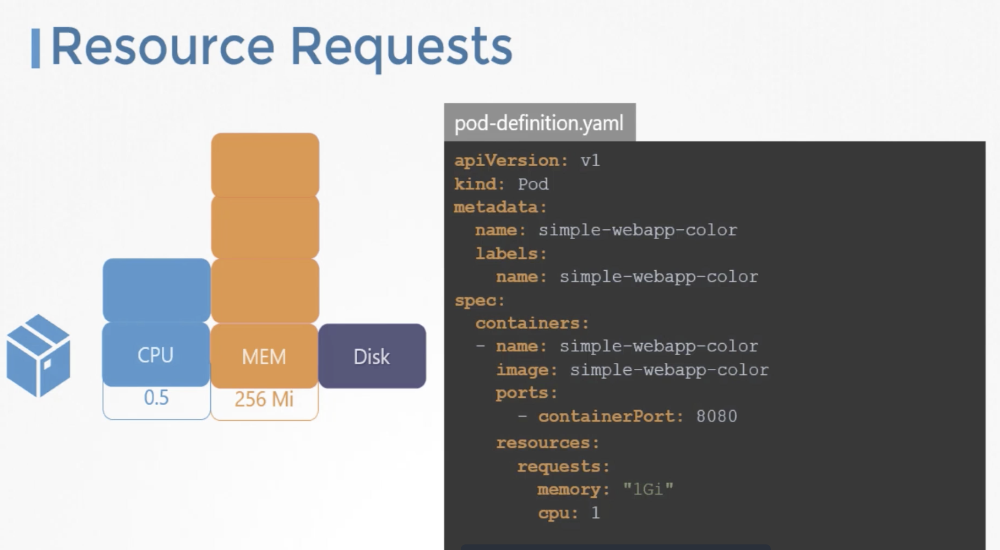
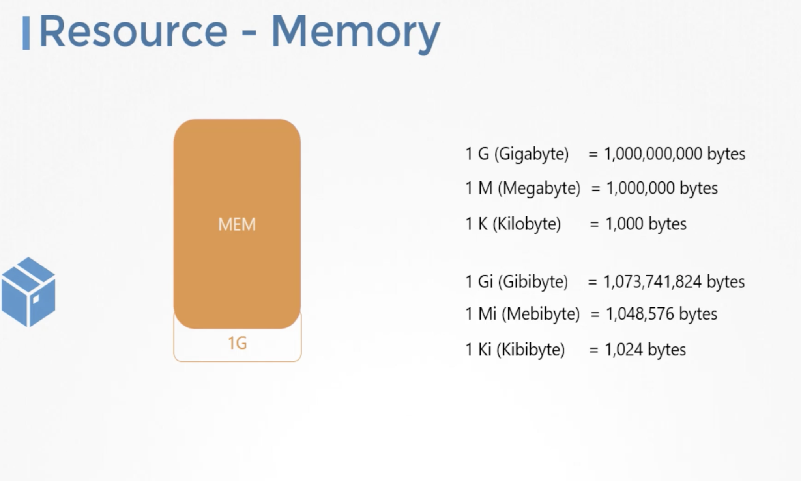
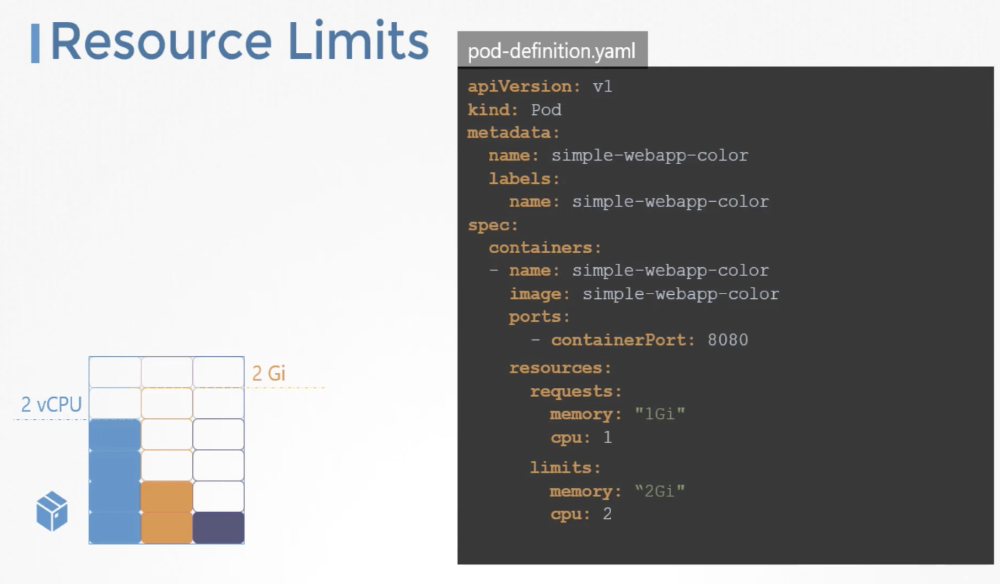

Let us consider a 3-node kubernetes cluster, each node has a set of CPU, memory and disk resources available. A POD consumes a set of resources. Whenever a POD is placed on a node, it consumes resources available to that node.   
Kubernetes scheduler decides to which node the POD goes to. The scheduler takes into consideration, the amount of resources required by a POD and those available on the nodes.   
If the node has no sufficient resources, the scheduler avoids placing the POD on that node instead places the POD on the one where sufficient resources are available.  
If there is no sufficient resources avaialble in any of the nodes, kubernetes holds back scheduling the POD, we will see the POD in `pending state`, in events we can see reason as `insufficient CPU`.  

## Resource Requirements for POD

By default, kubernetes assumes that a POD or a container inside the POD requires `0.5CPU` and `256 Mebi Byte of memory`. This is known as the resource request for a container i.e., the minimum CPU or memory requested by the container. When the schedular tries to place a POD on a node, it uses these numbers to identify a node which has sufficient number of resources available.  

If we know that our application needs more than these, we can modify these values by specfying them in POD or Deployment definition files.  

In the simple POD definition file, add a section called resources, under which add requests and specify new values of CPU and memory.

## Resources - CPU

1 count of CPU - 1 block of CPU.    
Blocks are used for illustration purpose only, it doesn't have to be in the increment of 0.5. We can specify any value as low as 0.1.  
0.1 CPU can also be expressed as `100 m` (m stands for milli). We can go as low as 1m but not lower than that.

1 count of CPU is equivalent to   

* 1 vCPU in AWS or
* 1 core in GCP or
* 1 core in Azure or
* 1 Hyperthread  

We could requests higher number of CPUs for the container, provided that nodes are sufficiently funded.   

Similarly, with memory, we can specify `256Mi` or specify the same value as `268435456` or use other suffix as below

  

In Docker world, a docker container has no limit to the resources it can consume on a node.  
Lets say, a container starts with 1vCPU on a node, it can go up and consume as much reource as it requires, suffocating the native processes on the node or other containers of resources. However, we can set a limit for the reouces usage on tehse PODs by adding `limit` section under `resources` section in pod-definition file(specfying new memory and CPU) as below.

When the POD is created, kubernetes sets new limits for the container.   
The limits and requests are set for each container within the POD.  

When a POD tries to exceed the resources beyond its specified limit,   
* In case of CPU, Kubernetes `THROTTLE` the CPU so that it does not go beyond the specified limit. A container cannot use more CPU resources than its limit.  
* In case of memory, a container can use memory resources than its limit. So, if a POD tries to consume more memory than its limit, constantly the POD gets terminated (when its reached maximum node resources).   

