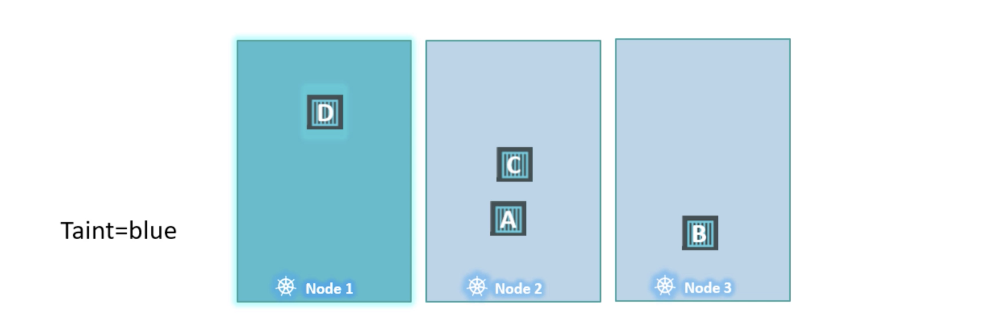
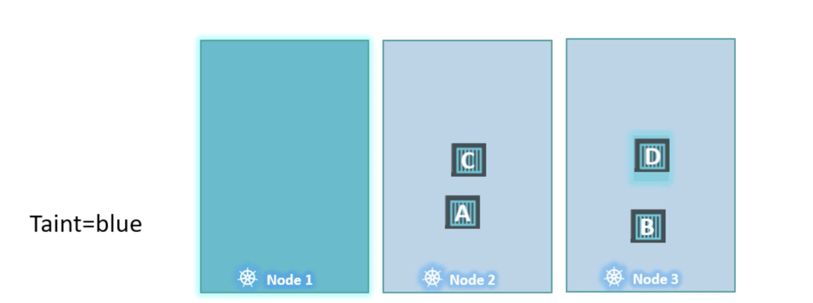
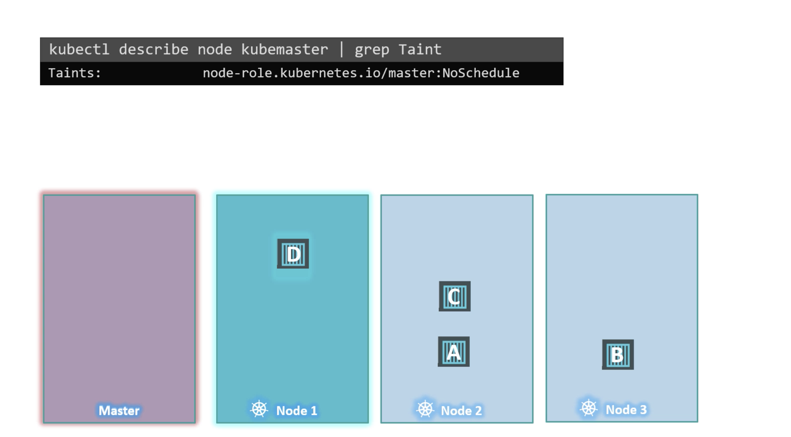

Taints and tolerations have nothing to do with security or intrusion on the cluster.  

`Taints` and `Tolerations` are used to set restrictions on what pods can be shared on that node.  

When the PODS are created, kubernetes scheduler tries to place these pods on the available worker nodes.  
As of now, there are no restrictions or limitations and so scheduler places the PODs across all of the nodes to balance them out equally.  

Let us assume, we have dedicated resources on node1 for a particular use case or application. so, we would like only those PODs that belong this application to be placed on node1.   

First, we prevent all PODs from placing on node1 by placing a taint on the node, lets say it as blue.  
By default, PODs won't have any tolerations i.e., unless specified otherwise none of the PODs can tolerate any taint. So, in this case none the PODs can be placed on node1 as none of them can tolerate the taint blue.  i.e., no unwanted PODs can be placed on node1.  
Now, we need to enable certain PODs to be placed on this node. For this, we must specify which PODs are tolerant for this particular taint. In our case, we would like to allow only POD D to be placed on this node. So, we add a toleration to POD D. POD D is now tolerant to blue. Now, when scheduler tries to place POD D on node1, it goes through. Node1 can only accept PODs that are tolerant to blue taint.  



!!! Note
    " Taints are set on nodes and Tolerations are set on PODs "

## Taints - Node

`kubectl taint nodes node-name key=value:taint-effect`    
To taint a node , specify the node name to taint followed by a taint itself which is a key value pair.   
taint-effect defines what would happen to the PODs if they do not tolerate the taint.   

There are three taint effects.  
* NoSchedule -- PODs will not be scheduled on the node.
* PreferNoSchedule -- The system will try to avoid placing a POD on the node but    that is not guaranteed. 
* NoExecute -- The new PODs will not be scheduled on the node and the existing pods on the nodes will be evicted if they do not tolerate the taint. These PODs may have been scheduled on the node before taint was applied on the node.   

`kubectl taint nodes node1 app=blue:NoSchedule`   

## Tolerations - PODs

To add a toleration to the POD, pull up the pod-definition file, under spec section, add tolerations section and in this section move all the values thats specified while placing taint on the node.  

`kubectl taint nodes node1 app=blue:NoSchedule`   

`pod-definition file`

```yaml
apiVersion: v1
kind: Pod
metadata: 
  name: myapp-pod
spec:
  containers:
   - name: nginx-container
      image: nginx
  tolerations:
    - key: "app"
      operator: "Equal"
      value: "blue"
      effect: "NoSchedule"
```

When the PODs are now created or update with new tolerations, they are either not scheduled on node1 or evicted from the existing node, depending on the effect set.  

Taints and Tolerations are only meant to retsrict nodes from accepting certain PODs. It does not gurantee that the POD with the toleration will be kept only placed on the node with taint. Since there won't be any taints on other nodes, the POD with toleration can very well be placed on other nodes.

  

!!! Note
    " Taints and Tolerations does not tell the POD to go to a particular node. Instead, it tells the node to only accept PODs with certain Tolerations."

## Master Node

The scheduler does not schedule any PODs on the master node.   
When the kubernetes cluster is first set up, a taint is set up on the master node automatically that prevents any PODs from being scheduled on this node.  
We can modify this if required. However, the best practice is to not deploy application workloads on master server.  

To view the taints on the master node   
`kubectl describe node <nodename> | grep Taint`  




