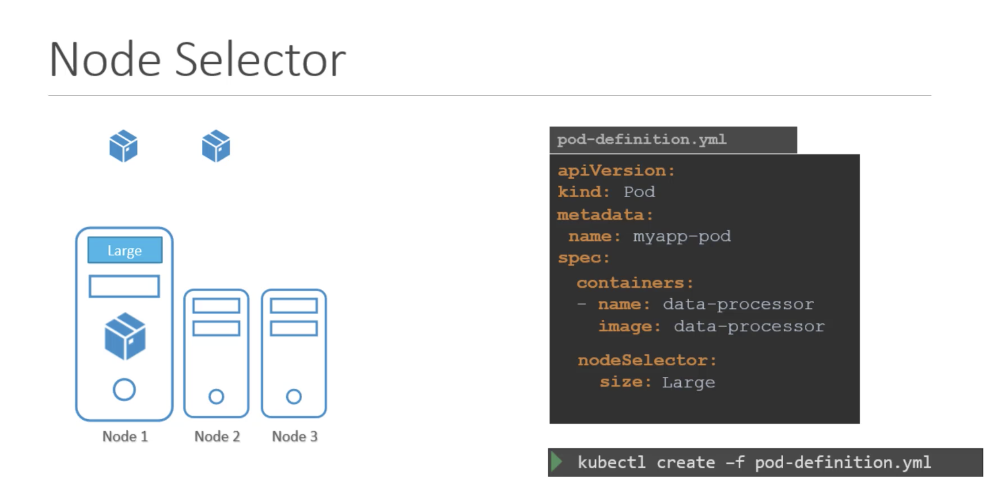
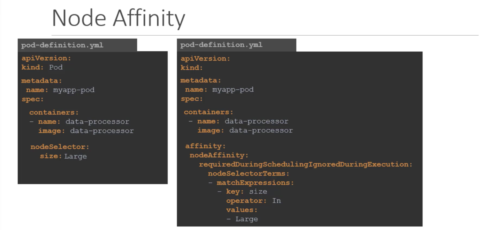
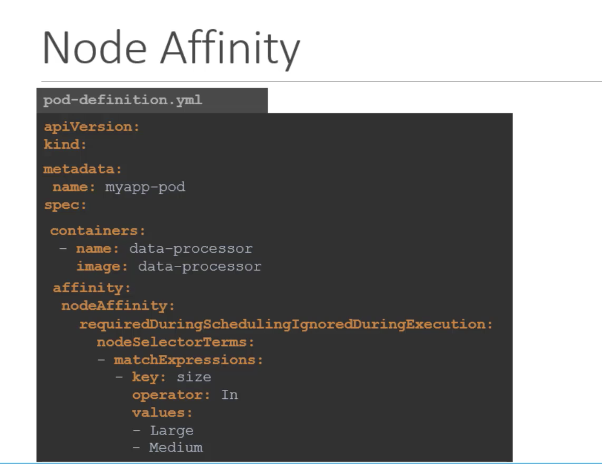
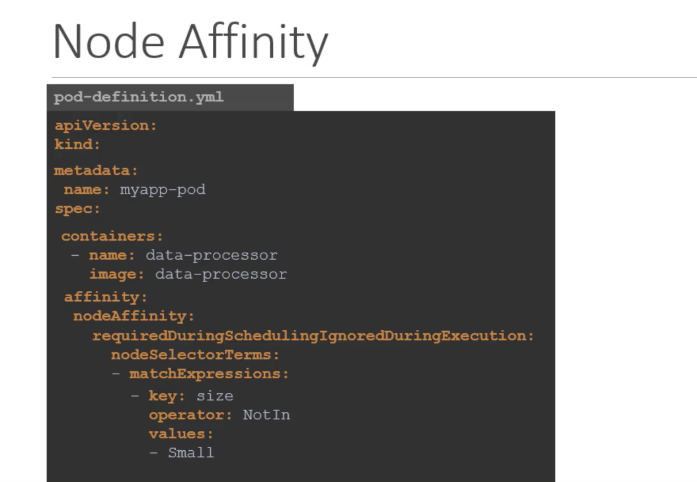
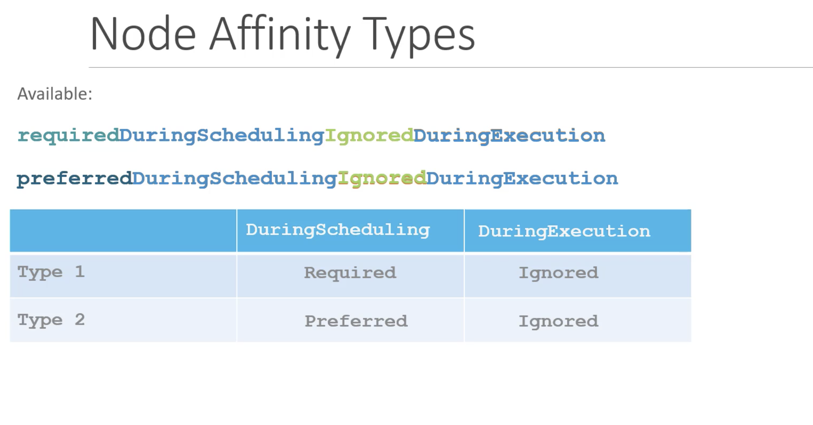
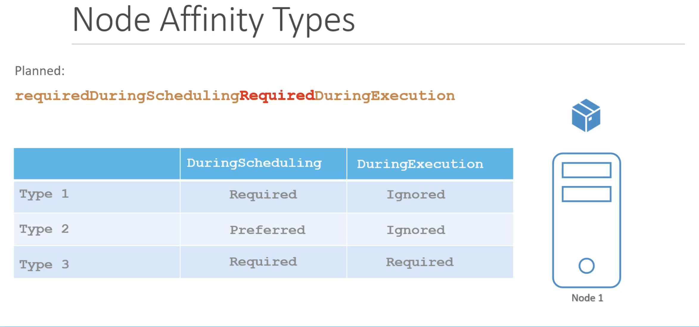

Let us start with a simple example,  
We have 3 node cluster of which 2 are smaller nodes with lower hardware resources and one of them is a larger node configured with higher resources.  
We have different kinds of workloads running in the cluster, we would like to dedicate the data processing workloads that require higher horse power to the larger node as that is the only node that will not run out of resources, in case job demands extra resources.   
However, in the current default setup any PODs can go any nodes. Therefore, the POD that requires higher horse power may end up placed on the smaller node.   

To solve this, we can set limitation on PODs, so that they only run on particular nodes.  

There are two ways to do this.  
* Node Selectors
* Node Affinity

## Node Selectors

`pod-definition file`
```yaml
apiVersion: v1
kind: Pod
metadata:
  name: myapp-pod
spec:
  containers:
  - name: data-processor
    image: data-processor
  # To limit this pod to run on larger node
  nodeSelector:
    size: Large
    # Large and smalls are the labels assigned to the node, the schedular uses this labels to match and identify the right nodes to place th pods on 
```
We need to label the node before using the labels in nodeSelector of Pod file.  

To label the node   
`kubectl label nodes <node-name> <label-key>=<label-value>`  
`kubectl label nodes node-1 size=Large`  

Now we can create the pod using `pod-definition file`  
`kubectl create -f pod-definition.yaml`  

Now when the pod is now created, it is placed on larger node as desired.  



## Limitations

We used a single label and selector to achieve our goals, but what if we have some complex requirement.   
For Example: Place the pod on a `large or medium` node, or something like place the pod on any node that are `not small`. We cannot achive this using node selector. for this, we use `Node Affinity`.

## Node Affinity

The primary purpose of Node Affinity feature is to ensure that pods are hosted on particular nodes.   
The Node Affinity feature provides us with advanced capabilities to limit pod placement on specific nodes.  

With great power, comes great complexity. So, the pod-definition file with Node Affinity looks as below.  



As per above screen, both Node selector and Node-Affinity do the same thing, that is placing pod on large node.

`For large or medium node`   



`For not in small node`  



If we did not set the size label for small nodes, we can just use exists as below

```yaml
key: size
operator: Exists
```

When the pods are created, these rules are considered and the pods are placed on to the right nodes.
If the node affinity could not match a node with the given expression, that is if we dont have any node with label size, then these can be handled by type affinity.

## Node Affinity Types
* requiredDuringSchedulingIgnoredDuringExecution
* preferredDuringSchedulingIgnoredDuringExecution



  


