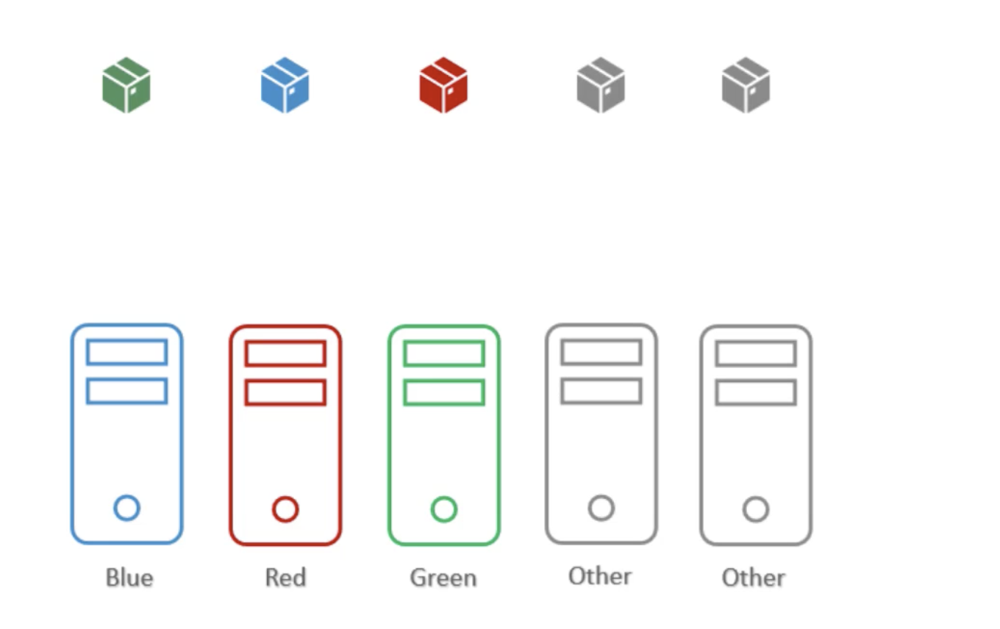
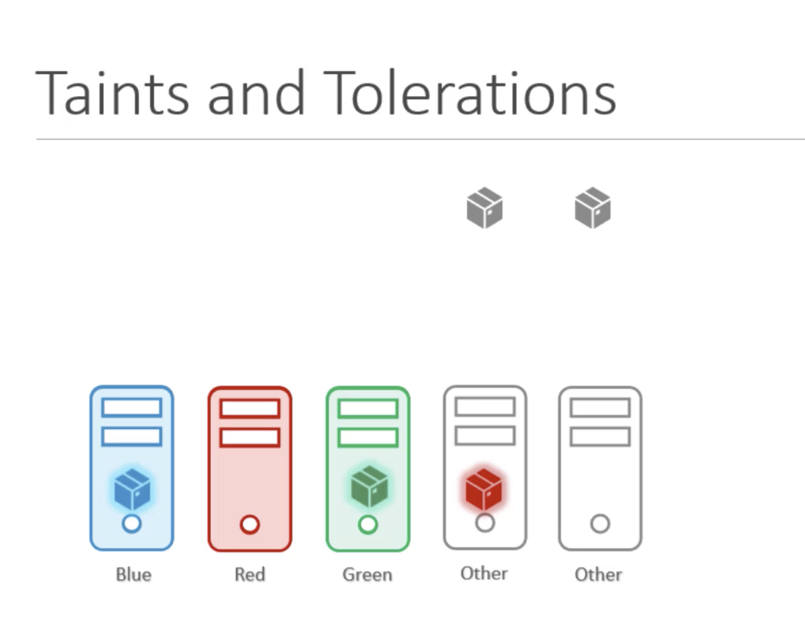
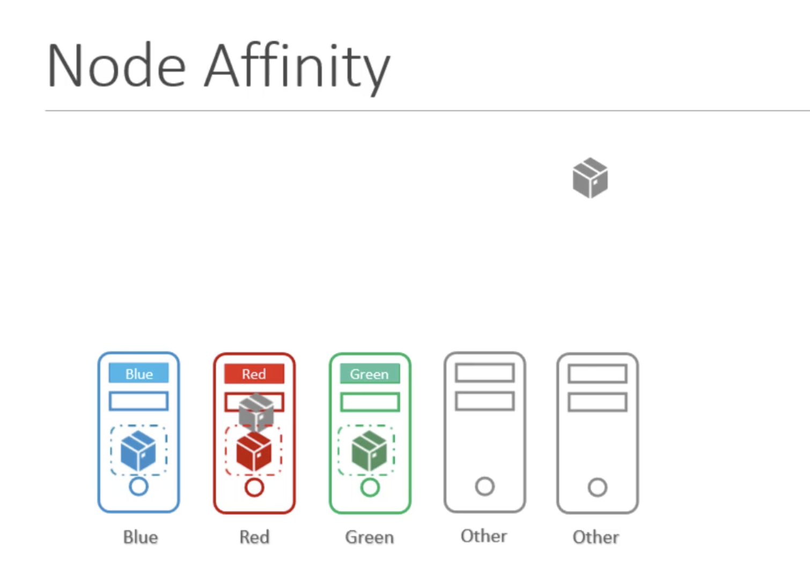
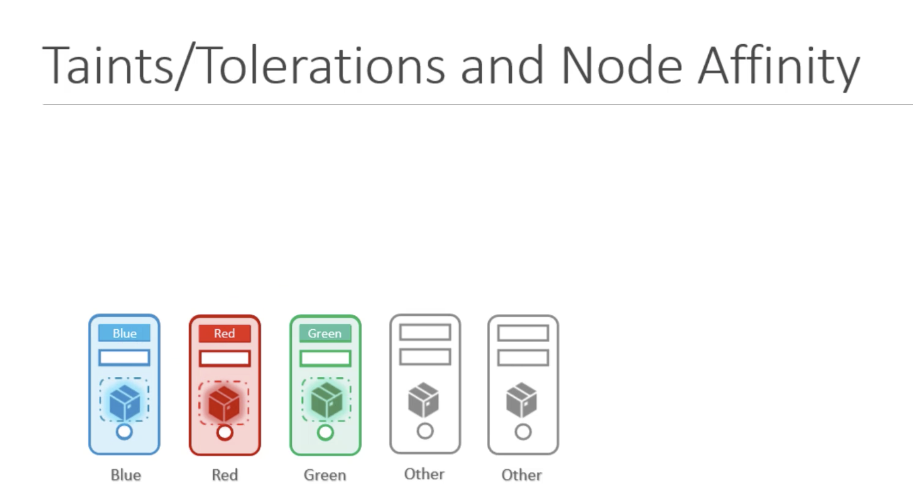

Let us assume,  
we have three nodes and three pods in three colors Blue, Red and Green as below.  

Th ultimate aim is to place blue pod in the blue node, red pod in the red node and the green pod in the green node.  
We have other pods in the cluster as well as other nodes.   
We do not want any other pods to be placed on our color nodes, neither we want our pods to be placed on their nodes.

## Using Taints and Tolerations

We apply a taint to the nodes marking them with their colors blue, red and green and set a tolerations on the pods to tolerate the respective colors.  
When the pods are now created, the nodes ensure they accept the pods with right toleration.  

However, taints and tolerations does not gurantee that the pods will only prefer these nodes, so any pod can ends up on other nodes which do not have any taint set.

## Using Node Affinity

With Node Affinity, we first label the nodes with their respective colors blue, red and green. We then set node selectors on the pods, to tie the pods to the nodes. As such, the pods end up on the right nodes. 

However, this does not gurantee that other pods are not placed on these nodes. In this case, there is a chance that one of the other pods may end up on our nodes as below.

## Using Taints/Tolerations and Node Affinity

Combination of Taints/Tolerations and Node affinity rules can be used together to cmpletely dedicate nodes for specific pods.  

We first use `Taints and Tolerations` to prevent other pods from being placed on our nodes and then we use `Node Affinity` to prevent our pods from being placed on other nodes.  

