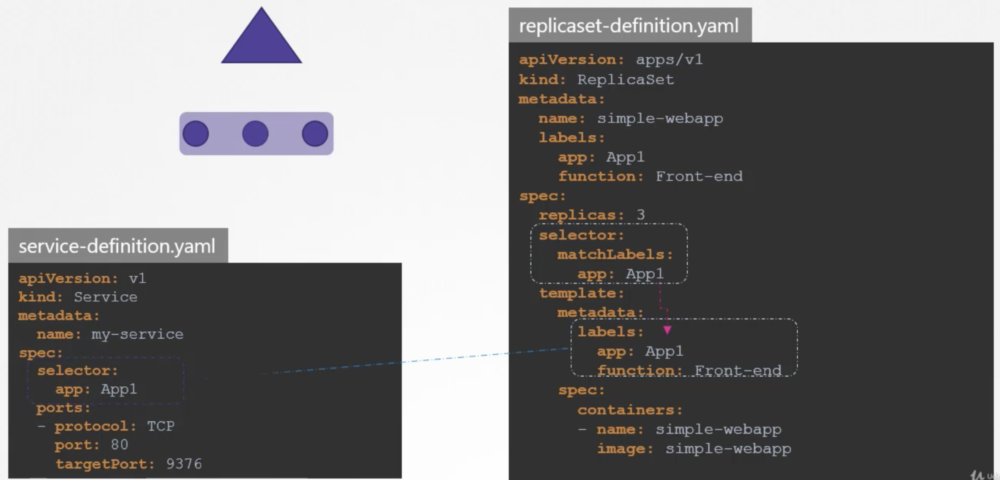
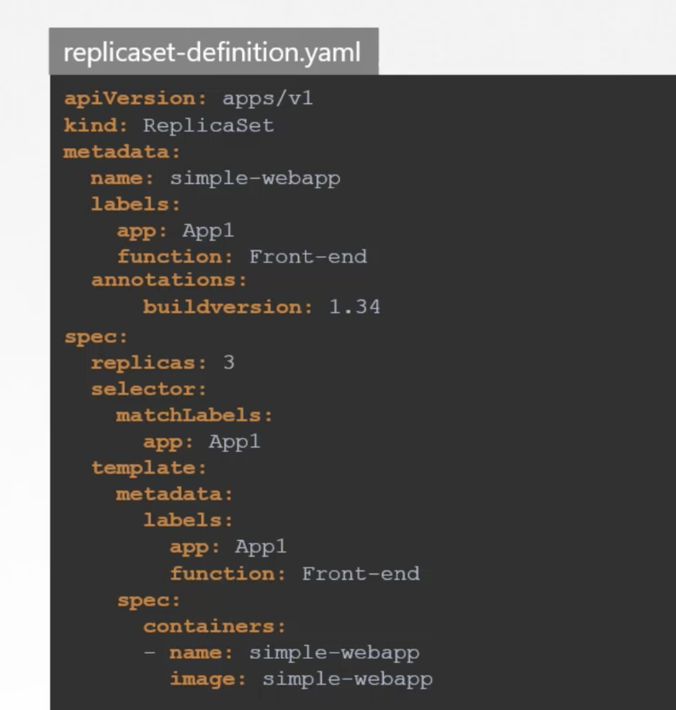

Labels and selectors are standard methods to group things together.  

`labels` are properties attached to each item.  
`selctors` help to filter the items based on labels.

We create a lot of different types of objects in kubernetes such as pods, services,  replicasets, deployments etc,.   
For kubernetes, all of these are different objects. Overtime, we may end up having hundreds or thousands of objects in our cluster. In this case, we need a way to filter and view different objects by different categories like view objects by type, by application or by functionality.
we can group and select objects using labels and selectors.  

For each object, attach labels as per need like app, function etc,. Then while selcting, specify a condition to filter specific object like app=app1.

In pod-definition file, under metadata add labels as key value format. We can add as many labels as needed.  

Once the pod is created, to select the pod with the labels  
`kubectl get pods --selector <labels>`  
`kubectl get pods --selector app=app1`  

Kubernetes objects use labels and selectors internally to connect different objects together.  

While labels and selectors are used to group ans select objects, annotations are used to record other details for informative purpose.   
For Example, tool details like name, version, build version etc,. or contact details mail_id, phone number etc, that may be used for some kind of integration purpose.  

