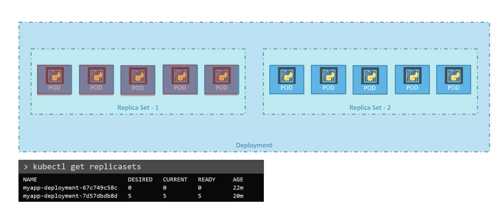
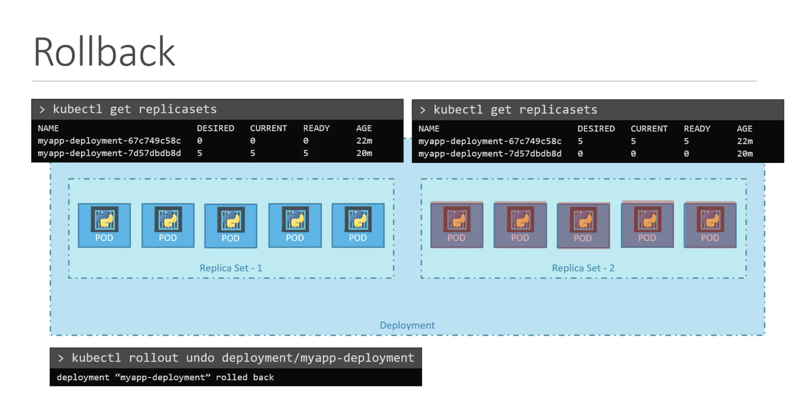
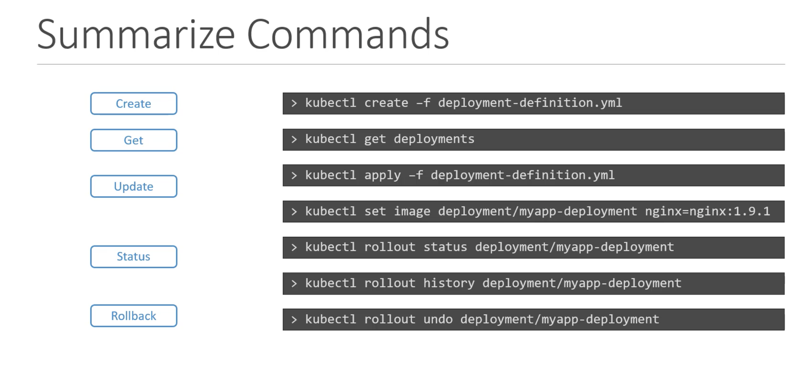

## Rollout and Versioning

When we first create a deployment, it triggers a rollout, a new rollout creates a new deployment revision. Let's call it revision 1.  
In future, when the application is upgraded i.e., container version is updated with a new image, a new rollout is triggered and a new deployment revision is created named revision2.  
This helps us to keep track the changes made to our deployment and enables us to rollback to the previson versions of deployment if necessary.  

To see the status of the rollout   
`kubectl rollout status <deployment name>`  

To see the revisions and history of rollout  
`kubectl rollout history <deployment name>`  
This will show the revisions and history of our deployment  

## Deployment Strategy

There are two types of deployment strategies.  
* When we have multiple replicas of web application instance deployed, one way to upgrade these to a newer version is to destroy all of these and then create newer versions of application instances.  
The problem with this is, for the period between the older version is down and newer version is up, the application is down and inaccessible to the users. This strategy is called `recreate strategy` and this is not the actual deployment strategy.  

* In the second strategy, we don't destroy all the instances once. Instead, we take down the older version and bring up a newer version one by one. This way the application never goes down and the upgrade is seemless. This is called `rollout strategy`.  If we do not specify a strategy while creating a deployment, by default it assumes the deployment strategy as `rolling update`.  
`Rolling update` is the default deployment strategy.  

Updating the deployment means like updating the container version, updating labels, updating number of replicas. We can modify these in the deployment efinition file. Once we make necessary changes we run  
`kubectl apply -f <deployment definition filename>`  to apply the changes.  
A new rollout is triggered and a new revision of the deployment is created.  

To update the image of the application, we can use  
`kubectl set image deployment <deploymentname> <podname>=<newimage>`   
If we do like this, the configurations will be different in the definition file, so we need to be careful when we use the same definition file in future for changes.  

To see the detailed information regarding deployments  
`kubectl describe deployment <deploymentname>`  
We will notice, when the recreate strategy is used, the old replicas are scaled down to 0 first and then the new replicas are scaled up.   
However, when the rolling update strategy is used, the old replicaset is scaled down one at a time, simultaneously scaling up the new replicaset one at a time.  

## Upgrades

When the new deployment is created, say to deploy 5 replicas. If first creates a replicaset automatically, which in turn creates the number of pods required to meet the number of replicas.   
When we upgrade our application, the kubernetes deployment object creates a new replicaset under the hoods and starts deploying the containers there. At the same time, taking down the pods from the old replicaset following a rolling update strategy.    
This can be seen using `kubectl get replicasets`  

  

## Rollback

For Example, once we upgrade our application, we realize something is wrong with the new version of the build we used to upgrade. So, we would like to rollback our update.  
To rollback to the previous revision or to undo a change  
`kubectl rollout undo deployment <deploymentname>`  
The deployment then destroy the pods in the new replicaset and bring the older ones up in the old replicaset. Then the application is back to older format.  

  

## Commands

We can check the status of each revision individually by using the --revision flag  
`kubectl rollout history deployment <deploymentname> --revision=<number>`  

Normally, the `change-cause` field will be empty in the rollout history.  
We can use the `--record` flag to save the command used to create/update a deployment against the revision number.
`kubectl set image deployment <deploymentname> <podname>=<newimage> --record`  

