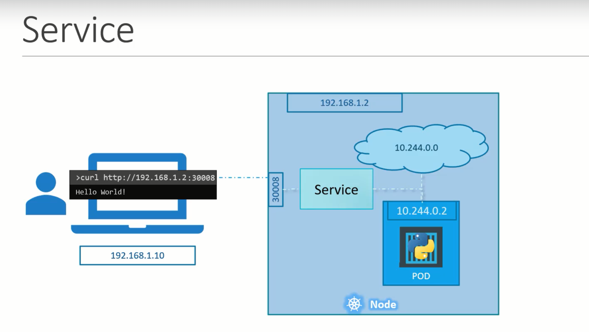
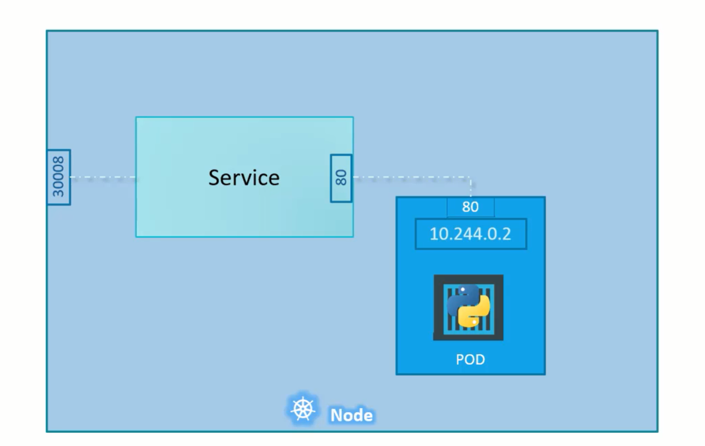
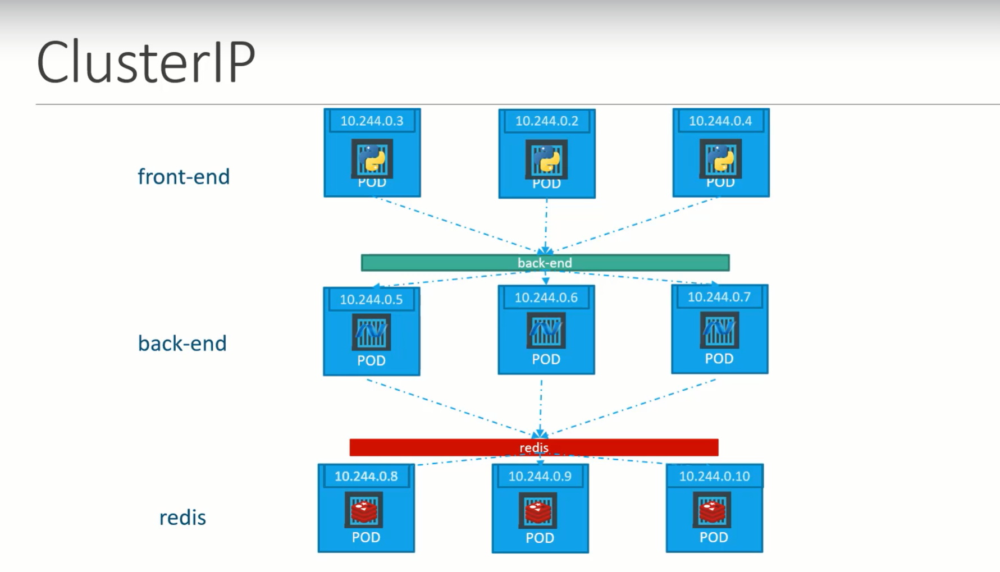

Kubernetes servcies enable various communications between various components within and outside of the application.  
Kubernetes servcies helps us to connect applications together and for the users.   

For Example: Our appliaction has group of pods serving various functions such as a group serving for front end load to users, another group running backend processes and third group connecting external database. 

It is services that enable connectivity between these group of pods. Services enable the front end application made available to end users,  it helps in communicating backend and frontend pods and helps in connecting to external database.  
Thus, servcies enable loose coupling between micro-services in our application.  

## External communication

We deployed a pod having web application running on it. How do we as an external user access the web page.  



This type of service is called a NodePort Servcie, as service listens to a port on the node and forwards request to POD.

## Service Types

## NodePort

Nodeport Service makes internal POD accessible on a port on the node.  

This servcie helps us by mapping a port on the POD to the port on the node.  



The port on the pod where an actual web server is running is 80 and it is referred to `target port` as this is the port where service forward the request to.  

Second port is the port on the service itself. It is simple referred to `port`.  
This terms are from the view point of the service.  

Finally, we have the port on the node itself, which we use to access the webserver externally and that is known as the `nodeport`.
Nodeport can only be in valid range i.e., 30000 to 32767.

`service-definition.yaml`

```yaml
apiVersion: v1
kind: Service
metadata: 
  name: myapp-service

spec:
  type: NodePort
  ports:
    - targetPort: 80 # will assumed to be same as port by default
      port: 80  # only mandatory
      nodePort: 30008 #if not provided, it will automatically assign the port in the valid range.
  selector:
  # to identify the pod
    app: myapp
    type: front-end
```

To create a service  
`kubectl create -f servcie-definition.yaml`  

To get all services  
`kubectl get services`  

To access the webservice  `curl http://<NodeIp>:<nodePort>`    
For Example: `curl http://192.168.1.2:30008`  

When we have multiple PODs running our web application, they will have the same labels and when we create a service, it will consider all the pods with the particular label as target pods. We don't have to do any additional configuration to access multiple instances of a POD.  
To balance the load across the multiple pods, it uses a random algorithm. Thus, service acts as a built-in load balancer to distribute load across different pods.  

When the pods are distributed across multiple nodes, in this case a web application on PODs on separate nodes in the cluster.  
When we create a service, without any additional configuration. The kubernets automatically creates a service that spans across all the nodes in the cluster and maps the targetport to the same nodePort on all the nodes in the cluster.  
This way, we can access the application using the IP of any node in the cluster and using the same port number.  

In any case, whether it can be a single pod on the single node, multiple pods on the single node or multiple pods on the multiple nodes, the service will be created exactly the same.  
When the PODs are removed or added, the service gets automatically updated making it highly flexible and adoptive. Once created, we won't typically have to make any additional configuration changes.

## ClusterIP

In this case, servcie creates a virtual IP inside the cluster to enable communication between a set of servers such as a set of front end servers to a set of backend servers.  

A service created for the backend pods will help to group all the backend pods together and provide a single interface for other pods to access the service. The requests are forwarded to one of the pods under the service.  



`service-definition.yaml`

```yaml
apiVersion: v1
kind: Service
metadata: 
  name: back-end
spec:
  type: clusterIp
  # clusterIP is the default type, if we didn't specify it, the service will automatically assumes it to be clusterIP.
  ports:
   - targetPort: 80 # where backend is exposed
     port: 80 # where servcie is exposed
  selector:
  # to link the service to set of pods
    app: myapp
    type: back-end 
```     

To create a service  
`kubectl create -f servcie-definition.yaml`  

To get all services  
`kubectl get services` 

This service can be accessed by other pods using IP address or service name.  

## LoadBalancer

This service provisions a load balancer for our application in supported cloud providers.  
For Example: To distribute load across the web servers in front end tier.


