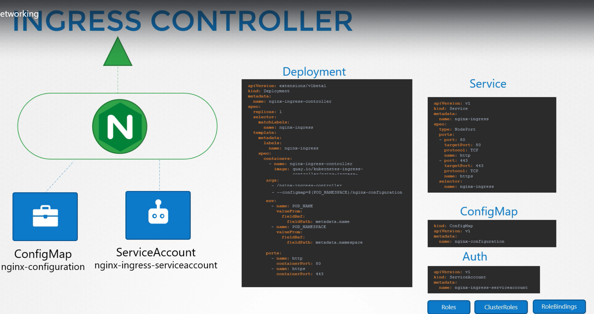
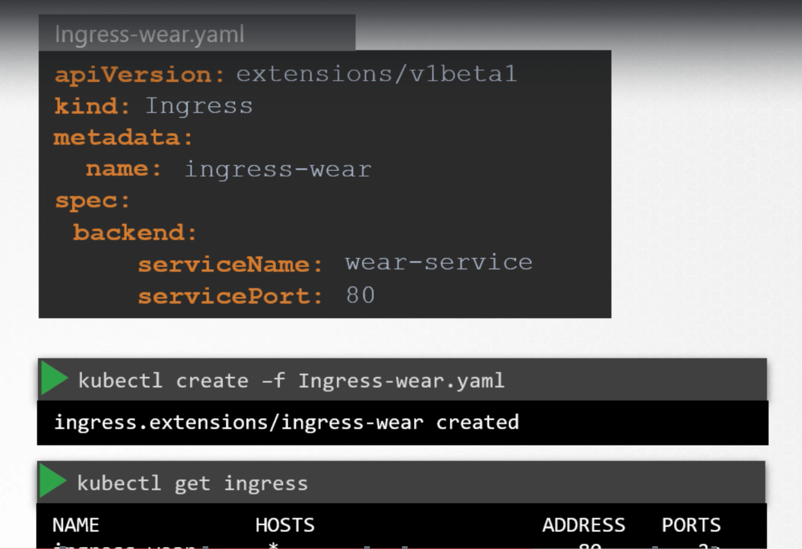

Ingress helps users to access the application using a single externally accessible url that we can configure to route to different services within the cluster based on the url path, at the same time implements SSL security.  

Ingress is a layer 7 load balancer built into the kubernetes cluster that can be configured using native kubernetes primitives just like any other object in kubernetes.  

Even with ingress, we still need to expose it to make it accessible outside the cluster or we still have to either publish it as NodePort or with a cloud native load balancer. But this is just one time configuration.  

Ingress first deploys a supported solution which can be nginx or HAproxy and then specify a set of rules to configure Ingress.  
The soultion we deploy is called as an `Ingress Controller` and the set of rules we configure are called as `Ingress Resources`.  
Ingress Resources are created using definition files as we created for pod, deployment etc,.  

## Ingress Controller

A kubernetes cluster does not come with Ingress Controller by default. We must deploy one.  
There are number of solutions available for Ingress. A few of them are GCE (Google's layer 7 HTTP Load Balancer), nginx, HAproxy, Contour, traefik and Istio. Out of these, GCE and nginx are currently supported and maintained by kubernetes.  

These Ingress Controllers are not just a load balancer or nginx server. The load balancer components are just a part of it. The Ingress Controllers have additional intelligence built into them to monitor kubernetes cluster for new definitions or ingress resources or configure the nginx server accordingly.  

An nginx Controller is deployed as just an other deployment in kubernetes.  

## Ingress Resources

 

