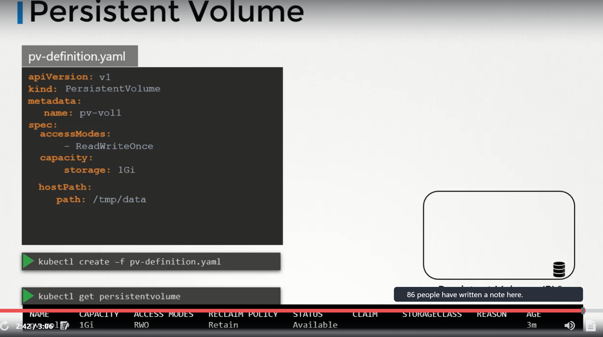

## Volumes in Docker

Docker Containers are meant to be transient in nature i.e., they are meant to last only for a short period of time.  
They are called upon when required to process data and destroyed once finished.  
The same is true, for the data within the container. The data is destroyed along with the container.  

To Persist data processed by the containers, we attach a volume to the containers when they are created. The data processed by the container is now placed in this volume there by retaining it permanently.   
Even if the container is deleted, the data generated or processed by it remains.  

## Volumes in Kubernetes

Just as in docker, the PODs created in kubernetes are transient in nature, when a POD is created to process data and then deleted. The data processed by it gets deleted as well. for this, we attach a volume to the POD.   
The data generated by the POD is now stored in the volume and even after the POD is deleted, the data remains. 

### Implementation

We have a single node kubernetes cluster. We create a simple POD that generates a random number between 1 and 100 and writes that to a file at /opt/number.out. It then gets deleted along with the random number.  

To retain the number generated by the POD, we create a volume and a volume needs a storage.  
When we create a volume, we can choose to configure its storage in different ways.  
Now we simple configure it to use a directory on the host.  
This way any files created in the volume, will be stored in the directory data on my node.   

Once the volume is created, to access it from a container we mount the volume to a directory inside the container.  
We use `volumeMounts` field in each container to mount the data volume to the directory /opt within the container. 

The random number will now be returned to /opt mount inside the container, which happens to be on the data volume which infact the data directory on the host.  

When the POD gets deleted, the file with the random number still lives on the host.  

### Volume Storage options

We can use `hostpath` option to configure a directory on the host as storage space for the volume. This works fine on a single node.  
This is not recommended to use on multi-node cluster.  

Volume storage on AWS 

## Persistent Volumes  

When we created volumes, we configured volumes within the pod definition file.  
Every configuration information required to configure storage for the volume goes within the pod definition file.  

When we have large environment, with lot of users deploying a lot of PODs, the users would have to configure storage everytime for each POD. 

To manage storage centrally or configured in a way that an administrator can create a large pool of storage and then have users carve out pieces from it as required.  
This is where persistant volumes can help us..  

A Persistent volume is a cluster wide pool of storage volumes configured by an adminstrator to be used by users deploying applications on the cluster.    
The users can now select storage from this pool using persistent volume claims.   

Accessmode defines how a volume should be mounted on the host whether in a read only mode, read write mode.   

The supported values are   

* ReadOnlyMany
* ReadWriteOnce
* ReadWriteMany  

Under capacity, specify the amount of storage to be reserved to this persistent volume.  
next comes the volume type, we use host path for this.  

## Persistent Volume Claims

We create Persistent Volume Claim to make the storage available to a node.  

Persistent Volumes and Persistent Volume Claims are two separate objects in the kubernetes namespace.  

An administrator creates a set of persistent volumes and a user creates persistent volume claims to use storage.  
Once the persistent volume claims are created, kubernetes binds the persistent volumes to claims based on the request and properties set on the volume.  
Every persistent volume claim is bound to a single persistent volume. During the binding process, kubernetes tries to find a persistent volume that has sufficient capacity as requested by the claim and any another request property such Acess Modes, Volume Modes, Storage Class etc,.  

If there are multiple matches for a single claim, and you would like to select a particular volume, we can use labels and selectors to bind to the right volumes.  

There is a one to one relationship between claims and volumes. So, no other claims can utilize the remaining capacity in the volume.   

If there are no volumes available, the persistent volume claim will remain in pending state, until the newer volumes are made available to the cluster. Once newer volumes are made available, the claim will automatically bound to the newly available volume.  

### Creation

 

To get the persistentVolumeClaim   
`kubectl get pvc`     

To delete the persistentVolumeClaim   
`kubectl delete persistentvolumeclaim <claimname>`   

We can choose what should happen to persistent volume, once pvc gets deleted.   
Bydefault `persistentVolumeReclaimPolicy` is set to `Retain` i.e., persistent volume retains until it is manually deleted by the administrator.  It is not available to use by any other claim.   
With `Delete` option, PV will be deleted as soon as PVC gets deleted.  
With `Recycle` option, the data in the persistent volume will be scrubbed before making it available to other claims.   

